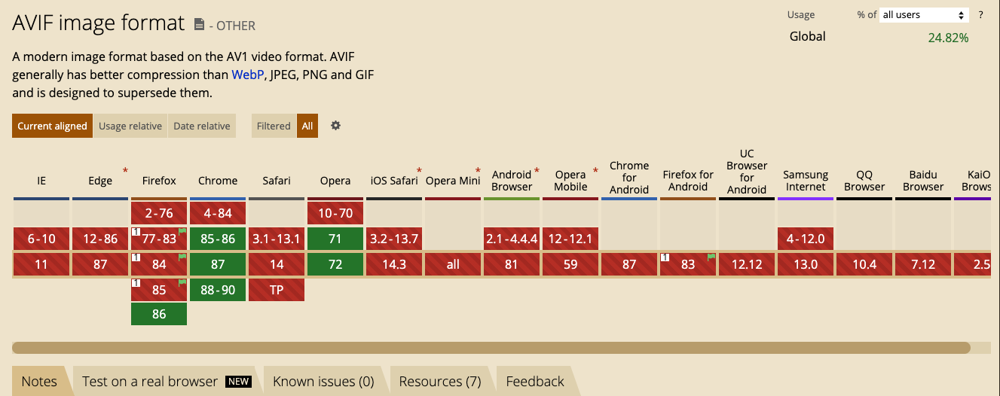

# AVIF 图片格式

> 文字需要翻译，图片不用。在图片的世界，不管是中国人、印度人、美国人、英国人的笑，全世界的人都能明白那是在笑。图片所承载的情感是全球通明的。

众所周知，一图胜千言，图片对于视觉的冲击效果远大于文字。但对于我们的互联网而言，传输与解析一张图片的代价要远比"千言"大的多的多(目前上亿像素已经成为主流)。

面对动辄 10 多 M 的大型图片，使用优化的图像来节省带宽和加载时间无疑是性能优化中的重头戏，无论对于用户还是公司都有巨大的意义。因为对于用户来说，可以更早的看到图片，对于公司而言，更加省钱。

在不使用用户提供的图片时，最简单就可以使用 [tinypng](https://tinypng.com/) 网站针对各个图片进行图像压缩与优化。在减少了近 50% 大小的同时做到了肉眼无法区分，收益是非常大的。

## AVIF 介绍

当然，目前最值得关注的新型图片格式是 AVIF（AV1 Image File Format，AV1图像文件格式，是业界最新的开源视频编码格式AV1的关键帧衍生而来的一种新的图像格式。AVIF 来自于 Netflix(著名的流媒体影视公司), 在 2020 年情人节公布。

当遇到新的技术时候，我们总是要考虑兼容问题，话不多说，我们打开 [caniuse](https://www.caniuse.com/) 。



就这？就这？是的，虽然当前的浏览器支持情况堪忧，但是开发者为了浏览器提供了 4kb 的 polyfill:

在使用 [avif](https://github.com/Kagami/avif.js) 后，我们可以使用的浏览器版本:

- Chrome 57+
- Firefox 53+
- Edge 17+
- Safari 11+

该格式的优势在于:

- 权威   
  AVIF 图片格式由开源组织 AOMedia 开发，Netflix、Google 与 Apple 均是该组织的成员, 所以该格式的未来也是非常明朗的。

- 压缩能力强   
  在对比中发现 AVIF 图片格式压缩很棒，基本上大小比 JPEG 小 10 倍左右且具有相同的图像质量。

- polyfill   
  面对之前浏览器无力情况提供 polyfill，为当前状况下提供了可用性

如果是技术性网站或某些 Saas 产品就可以尝试使用。

## 使用 Sharp 生成 AVIF

[Sharp](https://sharp.pixelplumbing.com/) 是一个转换格式的 node 工具库, 最近该库提供了对 AVIF 的支持。

我们可以在 node 中这样使用：

```js
const sharp = require("sharp");
const fs = require("fs");

fs.readFile("xxx.jpeg", (err, inputBuffer) => {
  if (err) {
    console.error(err);
    return;
  }

  // WebP
  sharp(inputBuffer)
    .webp({ quality: 50, speed: 1 })
    .toFile("xxx.webp");

  // AVIF 转换, 速度很慢
  sharp(inputBuffer)
    .avif({quality: 50, speed: 1})
    .toFile("xxx.avif");
});
```

在后端传入 jpg,png 等通用格式，这样我们便可以在浏览器中直接使用 AVIF。

虽然 AVIF 是面向未来的图片格式，但是就目前来说，在开发需要大量图片的业务时，使用专业的 OSS 服务和 CDN 才是更好的选择。  

由于 OSS 服务支持jpg、png、bmp、gif、webp、tiff等格式的转换，以及缩略图、剪裁、水印、缩放等多种操作，这样就可以更简单的根据不同设备(分辨率)提供不同的图片。同时 CDN 也可以让用户更快的获取图片。

## 参考资料

[node-avif](https://www.jameslmilner.com/post/node-avif/)
[tinypng](https://tinypng.com/)
[Sharp](https://sharp.pixelplumbing.com/)
