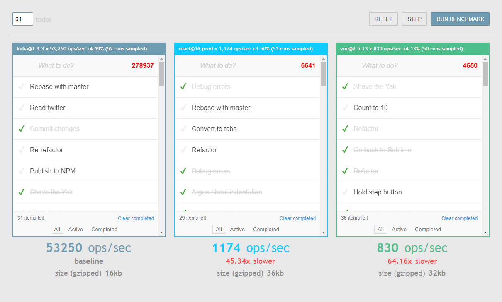

# imba 为什么那么快


我是标题党吗？是，但也不是。以图为证。



上图表示了vue, react 以及 imba 在 todo 这个项目中拥有60个 todoItem 不同进行 crud 操作的表现。可以看到 imba 达到了每秒操作5w次以上。如果你也想试一试该测试,可以访问 [Todos Bench](https://somebee.github.io/dom-reconciler-bench/index.html)。测试使用的是 [Benchmark.js](https://benchmarkjs.com/)。
## imba 简单介绍

imba 是一种新的编程语言，可以编译为高性能的 JavaScript。可以直接用于 Web 编程(服务端与客户端)开发。  
下面是语法：
```
// 自定义标签
tag App
    // 属性
	prop items

    // 方法定义
	def addItem
		if @input.value
			items.push(title: @input.value)
			@input.value = ""

	def toggleItem item
		item:completed = !item:completed

// 挂载 Imba.mount(element, into) 
// 如果没有第二个参数，默认挂载到 document.body 上面
Imba.mount <App.vbox items=[] ->
	<form.bar :submit.prevent.addItem>
		<input@input>
		<button> 'add'
	<ul> for item in items
		<li .done=item:completed :tap.toggleItem(item)> item:title
```
可以看出作者喜欢 ruby 以及 pug，偏向于缩进类风格(个人并不是很喜欢这种语法风格)。具体语法可以参考 [imba 文档](http://imba.io/guides/essentials/introduction)。当然了，因为可以编译成js，所以服务端编译成 js 进行node开发也是可以实现的。

## imba 框架极速的性能基础

任何一个实现的性能优化都有其理论基础，那么 imba 性能那么快的基础究竟是什么呢？答案也就是  memoized DOM（记忆DOM）。

### 理论基础
浏览器的 DOM 操作可以说是浏览器最终要的功能，无论框架是基于虚拟 DOM 或者是真实 DOM，最终离不开操作 DOM 对象。   
HTML DOM 是浏览器定义了访问和操作 HTML 文档的标准方法。但是操作 DOM 的接口是 JavaScript。但是浏览器通常会把 js 引擎和渲染引擎分开实现。也就是页面实际渲染部分是和解析js部分分开的。
借着《高性能的 JavaScript》话说，如果把 DOM 和 js 各自想象为岛屿。他们需要一座桥进行沟通。所以每一次执行 DOM 操作就过桥一次。  
那我们先谈谈虚拟DOM，虚拟DOM 的性能提升在于是将 DOM 的对比放在了js层。进而通过对比不同之处来进行实际的 DOM 渲染。也就是说，其实虚拟DOM 并没有“实际”的性能收益，桥仍旧还在那边。仅仅在 js引擎需要过桥的那边找到了一位聪明睿智的大叔,对过桥的人和过桥的货物进行优化和限制(虚拟DOM 高性能的diff算法，状态批量更新)。  
那么 memoized DOM 又是怎么做的呢？把 DOM 节点的控制直接放入内存之中。类似于此类优化.

```
function getEls(sel) {
    // 设置缓存
    if (!getEls.cache) getEls.cache = {};
    
    // 如果缓存中存在 el，直接返回 
    if (getEls.cache[sel]) {
        return getEls.cache[sel];
    }

    // 没有去通过 DOM 查询
    const r = document.querySelectorAll(sel || '☺'),
        length = r.length;
    
    // 缓存并返回元素节点
    return getEls.cache[sel] = (length == 1) ? r[0] : r;
}
```

我们可以测试一下。这里我写一个 getElsByDocument 以及 simplePerTest。

```
// 直接通过 querySelectorAll 获取节点
function getElsByDocument(sel) {
    const r = document.querySelectorAll(sel || '☺'),
        length = r.length;
    return length == 1 ? r[0] : r;
}

// 简单性能测试
function simplePerTest(fn, el) {
    const fnName = fn.name
    console.time(fnName)
    
    // 2000 次操作
    for(let i = 0,len = 2000; i < len; i++) {
        fn(el)
    }
    console.timeEnd(fnName)
}
```


这个缓存的节点查询可要比 querySelectorAll 快了 140倍以上啊，随着 img 节点越多，得到的性能提升也越高啊。如果imba 框架中所有的节点都在内存中呢？同时，我们还会得到一个 js 运行时优化( GC 的大量减少),因为虚拟DOM 要维护一个树，在进行多次 crud 之后就会产生大量无用对象从而导致浏览器进行 GC,而 memoized DOM 在多次 crud 不会进行多次 GC。(可能会在渲染引擎中 GC?但我感觉渲染引擎中GC 要比JS 中影响要小很多。挖个坑，研究完渲染引擎再来探讨一下)

### 框架实践
实例如下所示：
```
tag Component
	def render
		<self>
			<h1.title> "Welcome"
			<p.desc> "I am a component"
```
上面的自定义组件会编译成下面的js
```
var Component = Imba.defineTag('Component', function(tag){
    tag.prototype.render = function (){
        var $ = this.$;
        // 返回dom
        return this.setChildren($.$ = $.$ || [
            createElement('h1',$,0,this).flag('title').setText("Welcome"),
            createElement('p',$,1,this).flag('desc').setText("I am a component")
        ]).synced();
    };
});
```
仔细观察一下这里的函数，你会看到该组件在第一次调用渲染时，将使用 createElement 创建两个子节点，并设置它们的属性并且缓存。第二次或者第一万次调用时，children-array将被缓存，不会发生任何调用。

```
// 在第一次调用时候 $.$不存在  $.$会等于 后面的数组
// 第二次调用 $.$ 是存在的，无运行时消耗
$.$ = $.$ || 数组
```
其中查看源码，我们可以看到 setChildren 函数都是对真实DOM 进行了操作。获取之前的DOM节点进行一系列操作后将当前节点返回并缓存。
```
tag.prototype.setChildren = function (new$,typ){

	var old = this._tree_;
	
	if (new$ === old && (!(new$) || new$.taglen == undefined)) {
		return this;
	};
	if (!old && typ != 3) {
		this.removeAllChildren();
		appendNested(this,new$);
	} else if (typ == 1) {
		var caret = null;
		for (var i = 0, items = iter$(new$), len = items.length; i < len; i++) {
			caret = reconcileNested(this,items[i],old[i],caret);
		};
	} else if (typ == 2) {
		return this;
	} else if (typ == 3) {
		var ntyp = typeof new$;
			
		if (ntyp != 'object') {
			return this.setText(new$);
		};
			
		if (new$ && new$._dom) {
			this.removeAllChildren();
			this.appendChild(new$);
		} else if (new$ instanceof Array) {
			if (new$._type == 5 && old && old._type == 5) {
				reconcileLoop(this,new$,old,null);
			} else if (old instanceof Array) {
				reconcileNested(this,new$,old,null);
			} else {
				this.removeAllChildren();
				appendNested(this,new$);
			};
		} else {
			return this.setText(new$);
		};
	} else if (typ == 4) {
		reconcileIndexedArray(this,new$,old,null);
	} else if (typ == 5) {
		reconcileLoop(this,new$,old,null);
	} else if ((new$ instanceof Array) && (old instanceof Array)) {
		reconcileNested(this,new$,old,null);
	} else {
		// what if text?
		this.removeAllChildren();
		appendNested(this,new$);
	};	
	this._tree_ = new$;
	return this;
};
```

如果我们使用了动态属性。代码如下
```
tag Component
    def render
        <self>
            <h1.title> "Welcome"
            # 有 50% 几率 拥有 red class
            <p.desc .red=(Math.random > 0.5)> "IMBA"
```

可以得到如下代码，详细查看可以看出，imba 提取了可变量，放入了 synced 函数中，每次渲染中只会执行 synced 里面的数据，所以依然会得到极高的渲染速度

```
var Component = Imba.defineTag('Component', function(tag){
    tag.prototype.render = function (){
        var $ = this.$;
        return this.setChildren($.$ = $.$ || [
            _1('h1',$,0,this).flag('title').setText("Welcome"),
            _1('p',$,1,this).flag('desc').setText("Roulette")
        ],2).synced((
            $[1].flagIf('red',Math.random() > 0.5)
        ,true));
    };
});
```

精确的抽取不可变量，然后无需虚拟DOM 计算，同时对于真实DOM 还进行了缓存，我们可以看出 memoized DOM 与 虚拟DOM 不同，memoized DOM 是具有实际的性能收益。

## imba 框架“虚假”的性能测试

我们在上面看到了 imba 框架的理论基础，那么他是否真的比vue快50倍？当然不是，这也就是在上面说我是标题党的原因。

### 浏览器的运行机制

浏览器本身只能达到 60 fps( 1 秒刷新了60次 )。当然了，其实对于体验而言，60fps的体验已经差不多够用了，也就是浏览器渲染上大概需要 17ms 去渲染一次。事实上无论是每秒操作dom 5w次还是 1000次，浏览器渲染引擎也只会记录当前的脏数据。然后在需要渲染时候再进行重绘与重排。

### 真实世界的内存限制

面对 memoized DOM 的缓存优化以及更少 GC 带来的运行时提升，我们需要更多内存来对每一个 dom节点进行缓存。这个在初始化渲染时有大量的消耗。同时我们的浏览器执行速度和渲染速度已经足够快了，虚拟DOM已经完全够用了。

## imba 框架与浏览器的畅想

###  Google io 大会 chorme Portals 技术
单页应用程序（Single Page Applications，SPA）提供了很好的页面交互，但代价是构建的复杂性更高，多页面应用程序（Multi-page Applications，MPA）更容易构建，但最终会在页面之间出现空白屏幕。

Portals 结合了这两者的优势，主要用于改进网页交互体验，目标是无缝导航。它类似于 iframe ，内嵌在网页上，但可以导航到页面内容上。用户在一个页面跳转另一个内容时，虽然 URL 相应地发生变化，但是不需要打开另一个窗口，此时该内容标记的 Portals 会变成原来页面的顶级页面，同时原来页面在其后保持主进程地位。现场演示了这对于购物体验的极大便利，此外还有对漫画这类单页面应用的演示。


### js引擎 与 渲染引擎的关联

在之前，浏览器 js引擎和渲染引擎是没有任何关联的，我们去写动画只能通过 setTimeout 或者 setInterval，更加没有办法知道浏览器什么时候处于空闲状态,但是随着时间的发展，我们可以通过 requestAnimationFrame 和 requestIdleCallback。requestAnimationFrame 要求浏览器在下次重绘之前调用指定的回调函数更新动画。requestIdleCallback方法将在浏览器的空闲时段期间对要调用的队列函数进行执行。   
那么内置DOM 操作是否能够在js引擎中，是否能够减少过桥的性能消耗或者完全把桥打通。让我们拭目以待。


## 参考资料
[高性能JS-DOM](https://www.cnblogs.com/libin-1/p/6376026.html)   
[imba 性能篇](http://imba.io/guides/advanced/performance)

## 补充

当时思考不周到。   

下面列出vue作者的关于虚拟dom的评论：   
在比较性能的时候，要分清楚初始渲染、小量数据更新、大量数据更新这些不同的场合。Virtual DOM、脏检查 MVVM、数据收集 MVVM 在不同场合各有不同的表现和不同的优化需求。Virtual DOM 为了提升小量数据更新时的性能，也需要针对性的优化，比如 shouldComponentUpdate 或是 immutable data。    
- 初始渲染：Virtual DOM > 脏检查 >= 依赖收集    
- 小量数据更新：依赖收集 >> Virtual DOM + 优化 > 脏检查（无法优化） > Virtual DOM 无优化   
- 大量数据更新：脏检查 + 优化 >= 依赖收集 + 优化 > Virtual DOM（无法/无需优化）>> MVVM 无优化   
- 不要天真地以为 Virtual DOM 就是快，diff 不是免费的，batching 么 MVVM 也能做，而且最终 patch 的时候还不是要用原生 API。在我- 看来 Virtual DOM 真正的价值从来都不是性能，而是它 
	- 1) 为函数式的 UI 编程方式打开了大门；
	- 2) 可以渲染到 DOM 以外的 backend，比如 ReactNative。    

作者：尤雨溪   
链接：https://www.zhihu.com/question/31809713/answer/53544875   
来源：知乎   

imba之所以那么快，是在于依赖收集+真实dom操作，每次修改都可以精确的对dom操作，也就是指哪打哪。
