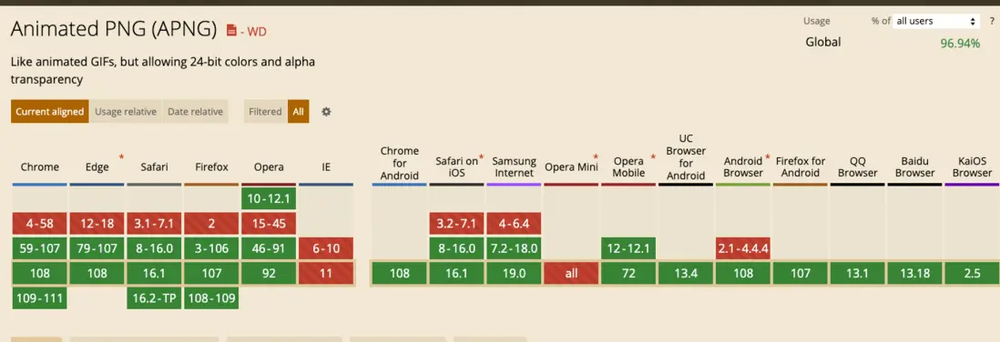

在项目开发的过程中，设计师不免会做一些动画效果来提升用户体验。如果当前效果不需要交互，只是用来展示的话，我们完全可以利用 GIF 或者 APNG 来实现效果。不了解 APNG 小伙伴可以看看这篇博客 [APNG 历史、特性简介以及 APNG 制作演示](https://www.zhangxinxu.com/wordpress/2014/09/apng-history-character-maker-editor/)。



但是如果当前动画除了展示还需要其他交互，甚至是一个组件需要动画效果，使用图片格式就不合理了。于是我写一个极其简单的 css 动画库 [rc-css-animate](https://github.com/wsafight/rc-css-animate)。这里直接使用 [animate.css](https://animate.style/) 作为 css 动画的依赖库。 animate.css 不但提供了很多交互动画样式类，也提供了动画运行速度，延迟，以及重复次数等样式类。

可以看到，默认的 animate.css 构建动画都需要携带前缀 “animate__”。

```html
<h1 class="animate__animated animate__bounce">An animated element</h1>
```

当然，该库是对 css 动画进行了一层封装，依然支持其他动画库以及自己手写的 css 动画，但如果开发者需要对动画进行各种复杂控制，不推荐使用此库。

## 使用

可以利用如下方式使用：

```tsx
import React, { useRef } from "react";
import ReactCssAnimate from "rc-css-animate";

// 引入 animate.css 作为动画依赖
import "animate.css";

function App() {
  const animateRef = useRef(null);

  return (
    <div className="App">
      <ReactCssAnimate
        // 定义当前展示动画的组件
        // 默认使用 div
        tag="div"
        // 当前组件的 className
        className=""
        // 当前组件的 style
        style={{}}
        // 当前组件的 ref
        ref={animateRef}
        // 动画前缀
        clsPrefix="animate__"
        // 当前动画的 className
        animateCls="animated backInDown infinite"
        // 动画开始时候是否处于展示状态
        initialVisible={false}
        // 获取动画结束是否处理展示状态
        getVisibleWhenAnimateEnd={(cls) => {
          // 如果当前 animateCls 中有 Out
          // 返回 false 则会在动画结束后不再显示
          if (cls.includes("Out")) {
            return false;
          }
          return true;
        }}
        // 动画结束回调
        onAnimationEnd={() => {
          console.log("done");
        }}
      >
        <div>
          测试动画
        </div>
      </ReactCssAnimate>
    </div>
  );
}
```

ReactCssAnimate 使用了 React hooks，但是也提供了兼容的类组件。同时也提供了全局的前缀设置。

```tsx
import React from "react";
import {
  // 使用类组件兼容之前的版本
  CompatibleRAnimate as ReactCssAnimate,
  setPrefixCls,
} from "rc-css-animate";

// 引入 animate.css 作为动画依赖
import "animate.css";

// 设置全局 prefix,会被当前组件覆盖
setPrefixCls("animate__");

/** 构建动画块组件 */
function BlockWrapper(props) {
  // 需要获取并传入 className, children, style
  const { className, children, style } = props;
  return (
    <div
      className={className}
      style={{
        background: "red",
        padding: 100,
        ...style,
      }}
    >
      {children}
    </div>
  );
}

function App() {
  return (
    <div className="App">
      <ReactCssAnimate
        tag={BlockWrapper}
        // 当前动画的 className
        animateCls="animated backInDown infinite"
      >
        <div>
          测试动画
        </div>
      </ReactCssAnimate>
    </div>
  );
}
```

## 源码解析

源代码较为简单，是基于 createElment 和 forwardRef 构建完成。其中 forwardRef 会将当前设置的 ref 转发到内部组件中去。对于 forwardRef 不熟悉的同学可以查看一下官网中关于 [Refs 转发的文档](https://react.docschina.org/docs/forwarding-refs.html)。

```tsx
import React, {
  createElement,
  forwardRef,
  useCallback,
  useEffect,
  useState,
} from "react";
import { getPrefixCls } from "./prefix-cls";
import { AnimateProps } from "./types";

// 全局的动画前缀
let prefixCls: string = "";

const getPrefixCls = (): string => prefixCls;

// 设置全局的动画前缀
export const setPrefixCls = (cls: string) => {
  if (typeof cls !== "string") {
    return;
  }
  prefixCls = cls;
};

const Animate = (props: AnimateProps, ref: any) => {
  const {
    tag = "div",
    clsPrefix = "",
    animateCls,
    style,
    initialVisible,
    onAnimationEnd,
    getVisibleWhenAnimateEnd,
    children,
  } = props;

  // 通过 initialVisible 获取组件的显隐，如果没有则默认为 true
  const [visible, setVisible] = useState<boolean>(initialVisible ?? true);

  // 当前不需要展示，返回 null 即可
  if (!visible) {
    return null;
  }

  // 没有动画类，直接返回子组件
  if (!animateCls || typeof animateCls !== "string") {
    return <>{children}</>;
  }

  useEffect(() => {
    // 当前没获取请求结束的设置显示隐藏，直接返回，不进行处理
    if (!getVisibleWhenAnimateEnd) {
      return;
    }
    const visibleWhenAnimateEnd = getVisibleWhenAnimateEnd(animateCls);

    // 如果动画结束后需要展示并且当前没有展示，直接进行展示
    if (visibleWhenAnimateEnd && !visible) {
      setVisible(true);
    }
  }, [animateCls, visible, getVisibleWhenAnimateEnd]);

  const handleAnimationEnd = useCallback(() => {
    if (!getVisibleWhenAnimateEnd) {
      onAnimationEnd?.();
      return;
    }

    // 当前处于展示状态，且动画结束后需要隐藏，直接设置 visible 为 false
    if (visible && !getVisibleWhenAnimateEnd(animateCls)) {
      setVisible(false);
    }
    onAnimationEnd?.();
  }, [getVisibleWhenAnimateEnd]);

  let { className = "" } = props;

  if (typeof className !== "string") {
    className = "";
  }

  let animateClassName = animateCls;

  // 获取最终的动画前缀
  const finalClsPrefix = clsPrefix || getPrefixCls();

  // 没有或者动画前缀不是字符串，不进行处理
  if (!finalClsPrefix || typeof finalClsPrefix !== "string") {
    animateClassName = animateCls.split(" ").map((item) =>
      `${finalClsPrefix}${item}`
    ).join(" ");
  }

  // 创建并返回 React 元素
  return createElement(
    tag,
    {
      ref,
      onAnimationEnd: handleAnimationEnd,
      // 将传递的 className 和 animateClassName 合并
      className: className.concat(` ${animateClassName}`),
      style,
    },
    children,
  );
};

// 利用 forwardRef 转发 ref
// 第一个参数是 props，第二个参数是 ref
export default forwardRef(Animate);
```

以上代码全部在 [rc-css-animate](https://github.com/wsafight/rc-css-animate) 中。这里也欢迎各位小伙伴提出 issue 和 pr。

## 参考资料

[APNG 历史、特性简介以及 APNG 制作演示](https://www.zhangxinxu.com/wordpress/2014/09/apng-history-character-maker-editor/)

[rc-css-animate](https://github.com/wsafight/rc-css-animate)

[animate.css](https://animate.style/)
