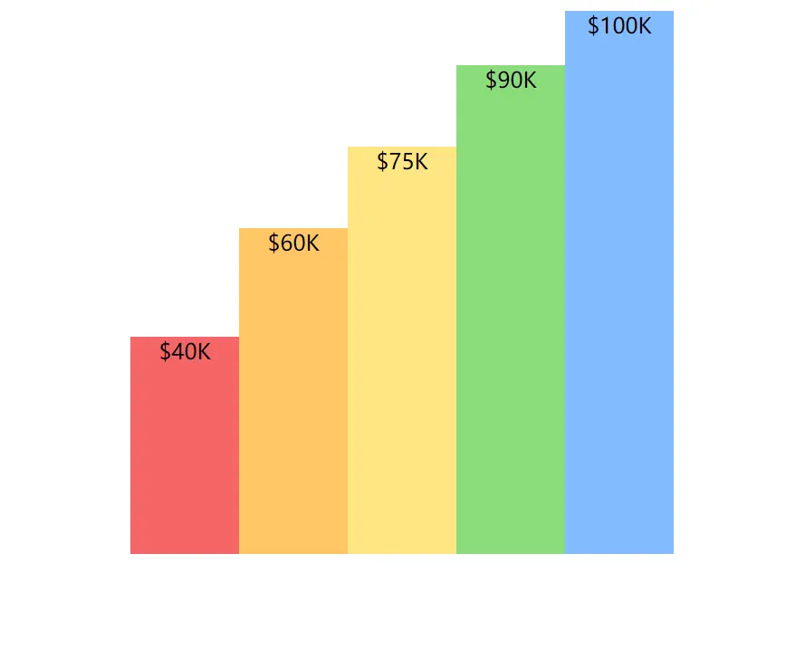
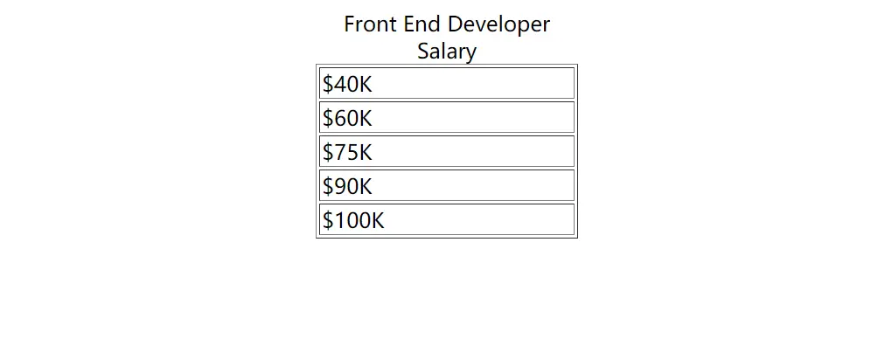

> 一图胜千言

可视化领域是目前（泛）前端中最火热的分支之一。无论是面向普通用户的可视化大屏展示数据信息，还是企业服务中数据统计概览或者调度服务，乃至于国家大力推动的智慧建设（智慧大脑，智慧城市）等项目，都重度使用了数据可视化技术。

以下图片来自于 [**前端搞可视化**](https://www.yuque.com/zaotalk/conf/ot7ia8) 菜鸟体验体验技术 其歌 的分享 《如何融合数据可视化与物理世界》。我们可以看到：可视化结合硬件也有很大的用武之地。


## 可视化是什么

当然，我曾经一度认为可视化就是绘制各种图表，学习可视化就是学习 echarts, D3 等库，然后利用这些工具绘制饼图、折线图、柱状图这类图表。然而，大部分情况下，我们是可以借助这些库来进行可视化项目的开发。但这些库是通用的解决方案。特定条件下，如在短时间内同时渲染大量元素，通用的解决方案就无法使用，此时我们就需要选择更加底层的方案（如利用 WebGL 自行控制 GPU 渲染图像）。

可视化的源头是数据。我们需要拿到有用的数据，然后通过转化以及整合数据生成用户所需要的结构，最终以图形的方式展现出来。可视化一定是与当前业务高度结合的。可视化工程师需要根据当前的业务以及产品需求，选择合适当前业务的技术栈并生成对用户有用的图像。

可视化的目的是提升用户对数据的认知能力，解放用户的大脑，从而让数据更有价值。

## 用 css 做数据可视化

通常来说，SVG 易于交互，Canvas2D 性能更好。基本上会根据当前交互和计算量来确定使用 SVG 或者 Canvas 。 如果遇到大量像素计算，甚至还需要通过 WebGL 深入 GPU 编程(自行控制 CPU 并行计算) 。

但如果我们做官网首页的图表呢？如果当前的图表很简单，不需要变化呢？我们还需要引入 ECharts 这种库？或者说手动写一个图表。

实际上，随着浏览器的发展，CSS 的表现能力愈发强大，完全可以实现常规的图表。如柱状图和饼图等。使用网格布局（Grid Layout）加上线性渐变（Linear-gradient）可以直接生成柱状图。

```html
<style>
.bargraph {
  margin: 0 auto;   
  display: grid;
  width: 250px;
  height: 200px;
  padding: 10px;
  transform: scaleY(3);
  grid-template-columns: repeat(5, 20%);
}

.bargraph div {
  margin: 0 5px;
}

.bargraph div:nth-child(1) {
  /** 从上到下(to bottom 默认，可不写)，75% 全透明， 25% 红色，  **/  
  background: linear-gradient(to bottom, transparent 75%, red 0);
}

.bargraph div:nth-child(2) {
  background: linear-gradient(transparent 74%, yellow 0);
}

.bargraph div:nth-child(3) {
  background: linear-gradient(transparent 60%, blue 0);
}

.bargraph div:nth-child(4) {
  background: linear-gradient(transparent 55%, green 0);
}

.bargraph div:nth-child(5) {
  /** 也可以多种颜色渐变  **/    
  background: linear-gradient(transparent 32%, #37c 0, #37c 63%, #3c7 0);
}
</style>

<body>
    <div class="bargraph">
        <div></div>
        <div></div>
        <div></div>
        <div></div>
        <div></div>
    </div>  
</body>
```




我们还可以使用圆锥渐变 **conic-gradient** 实现饼图，以及使用 div + **transform** 实现折线图。

当然，用 CSS 进行图表绘制优点在于不需要学习额外的库和 api。但缺点也很明显：

- 对应关系复杂，无法直观的修改当前代码以快速替换当前图标样式（换算往往需要 JavaScript ）

- 属于 DOM 树的一员，性能往往难以把控（作为稳定的的首页图表，不会由太大问题）


## 图表库 Chart.css

在没有遇到 [Charts.css](https://chartscss.org/) 之前, 我认为图表是离不开 JavaScript 计算的。但看到该库时候，我也是非常的欣喜。**Charts.css** 是一个 CSS 框架。它使用 CSS3 将 HTML 元素设置为图表样式，同时该库其中一个设计原则就是不会使用 JavaScript 代码（如果无法使用CSS完成，则不会成为框架的一部分 ）。当然，用户可以自行决定是否使用 JavaScript 。

拿出最简单的表格为例：

```html
<table border="1">
    <caption> Front End Developer Salary </caption>
    <tbody>
    <tr>
        <td> $40K </td>
    </tr>
    <tr>
        <td> $60K </td>
    </tr>
    <tr>
        <td> $75K </td>
    </tr>
    <tr>
        <td> $90K </td>
    </tr>
    <tr>
        <td> $100K </td>
    </tr>
    </tbody>
</table>
```


如图所显：



使用 Chart.css 之后:

```html
<table style="width: 400px;height: 400px" class="charts-css column">
  <caption> Front End Developer Salary </caption>
  <tbody>
    <tr>
      <td style="--size: calc( 40 / 100 )"> $40K </td>
    </tr>
    <tr>
      <td style="--size: calc( 60 / 100 )"> $60K </td>
    </tr>
    <tr>
      <td style="--size: calc( 75 / 100 )"> $75K </td>
    </tr>
    <tr>
      <td style="--size: calc( 90 / 100 )"> $90K </td>
    </tr>
    <tr>
      <td style="--size: calc( 100 / 100 )"> $100K </td>
    </tr>
  </tbody>
</table>   
```


非常棒！

我们可以看到其中最重要的修改是使用了 CSS 变量，CSS 虽然不像 JavaScript 是通用编程语言，但 CSS 变量却是一个桥梁，让其拥有了与其他元素沟通的能力（HTML， JavaScript），其次借助 CSS 中的计算属性 calc 。同时也可以参考我之前写的的博客 [玩转 CSS 变量](https://github.com/wsafight/personBlog/issues/25) 和 [CSS 扫雷游戏](https://propjockey.github.io/css-sweeper/) 。

```css
/** 图表 css 中会有很多这种计算代码 **/ 
height: calc(100% * var(--end, var(--size, 1)));
```


当然，该库目前可以描述水平条形图（bar）、柱状图（column）、面积图 (area)、折线图（line）。饼图，雷达图等还在开发中。当然该库也可以实现混合图表：


Charts.css 同时支持用户使用 CSS3 为当前图表添加各种效果，详情见 [定制化](https://chartscss.org/customization/) 。

## 参考资料

《如何融合数据可视化与物理世界》

[跟月影学可视化](https://time.geekbang.org/column/intro/320)

[Charts.css](https://chartscss.org/)

