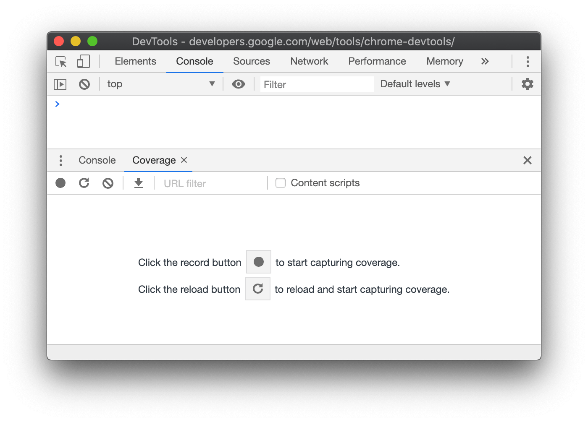
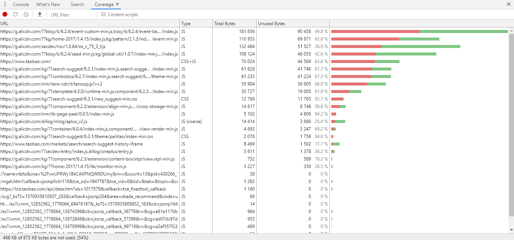
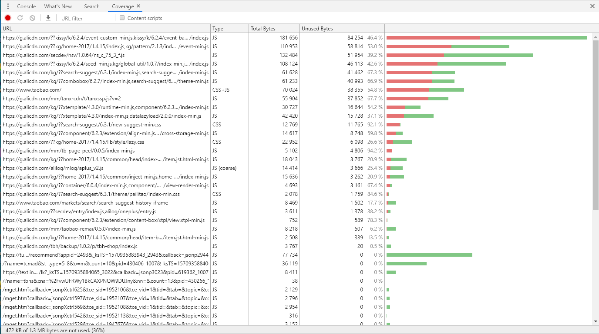
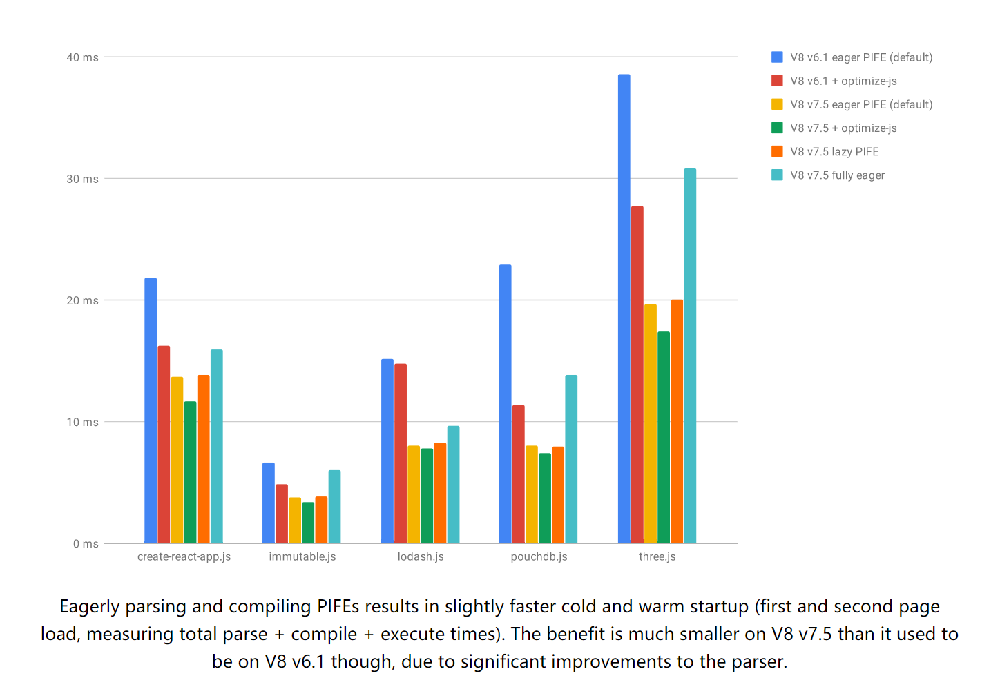

在开发 web 应用程序时候，性能都是必不可少的话题。而大部分的前端优化机制都已经被集成到前端打包工具 webpack 中去了，当然，事实上仍旧会有一些有趣的机制可以帮助 web 应用进行性能提升，在这里我们来聊一聊能够优化 web 应用程序的一些机制，同时也谈一谈这些机制背后的原理。

## Chrome Corverage 分析代码覆盖率

在讲解这些机制前，先来谈一个 Chrome 工具 Corverage。该工具可以帮助查找在当前页面使用或者未使用的 JavaScript 和 CSS 代码。

工具的打开流程为：
- 打开浏览器控制台 console
- ctrl+shift+p 打开命令窗口  
- 在命令窗口输入 show Coverage 显示选项卡

webpackjs



- 其中如果想要查询页面加载时候使用的代码,请点击 reload button
- 如果您想查看与页面交互后使用的代码,请点击record buton

这里以淘宝网为例子，介绍一下如何使用





上面两张分别为 reload 与 record 点击后的分析。

其中从左到右分别为 
- 所需要的资源 URL
- 资源中包含的 js 与 css
- 总资源大小
- 当前未使用的资源大小

左下角有一份总述。说明在当前页面加载的资源大小以及没有使用的百分比。可以看到淘宝网对于首页代码的未使用率仅仅只有 36%。

介绍该功能的目的并不是要求各位重构代码库以便于每个页面仅仅只包含所需的 js 与 css。这个是难以做到的甚至是不可能的。但是这种指标可以提升我们对当前项目的认知以便于性能提升。

提升代码覆盖率的收益是所有性能优化机制中最高的，这意味着可以加载更少的代码，执行更少的代码，消耗更少的资源,缓存更少的资源。

## webpack externals 获取外部 CDN 资源

一般来说，我们基本上都会使用 Vue，React 以及相对应的组件库来搭建 SPA 单页面项目。但是在构建时候，把这些框架代码直接打包到项目中，并非是一个十分明智的选择。

我们可以直接在项目的 index.html 中添加如下代码
```
 <script src="//cdn.jsdelivr.net/npm/vue@2.6.10/dist/vue.runtime.min.js" crossorigin="anonymous"></script>
 
 <script src="//https://cdn.jsdelivr.net/npm/vue-router@3.1.3/dist/vue-router.min.js" crossorigin="anonymous"></script>
```

然后可以在 webpack.config.js 中这样配置
```

module.exports = {
  //...
  externals: {
    'vue': 'Vue',
    'vue-router': 'VueRouter',
  }
};

```
[webpack externals](https://webpack.js.org/configuration/externals/#root) 的作用是 不会在构建时将 Vue 打包到最终项目中去，而是在运行时获取这些外部依赖项。这对于项目初期没有实力搭建自身而又需要使用 CDN 服务的团队有着不错的效果。

### 原理

这些项目被打包成为第三方库的时候，同时还会以全局变量的形式导出。从而可以直接在浏览器的 window 对象上得到与使用。即是

```
window.Vue 
// ƒ bn(t){this._init(t)}
```

这也就是为什么我们直接可以在 html 页面中直接使用

```
<div id="app">
  {{ message }}
</div>

// Vue 就是 挂载到 window 上的，所以可以直接在页面使用

var app = new Vue({
  el: '#app',
  data: {
    message: 'Hello Vue!'
  }
})
```
此时我们可以通过 [webpack Authoring Libraries](https://webpack.js.org/guides/author-libraries/#root) 来了解如何利用 webpack 开发第三方包。


### 优势与缺陷

#### 优势

对于这种既无法进行代码分割又无法进行 Tree Shaking 的依赖库而言，把这些需求的依赖库放置到公用 cdn 中,收益是非常大的。

#### 缺陷

对于类似 Vue React 此类库而言，CDN 服务出现问题意味着完全无法使用项目。需要经常浏览所使用 CDN 服务商的公告(不再提供服务等公告)，以及在代码中添加类似的出错弥补方案。

```
<script src="//cdn.jsdelivr.net/npm/vue@2.6.10/dist/vue.runtime.min.js" crossorigin="anonymous"></script>

<script>window.Vue || ...其他处理 </script>
```

## webpack dynamic import 提升代码覆盖率

我们可以利用 webpack 动态导入，可以在需要利用代码时候调用 getComponent。在此之前，需要对 webpack 进行配置。具体参考 [webpack dynamic-imports](https://webpack.js.org/guides/code-splitting/#dynamic-imports)。

在配置完成之后，我们就可以写如下代码。
```

  async function getComponent() {
    const element = document.createElement('div');


    /** webpackChunkName，相同的名称会打包到一个 chunk 中 */
    const { default: _ } = await import(/* webpackChunkName: "lodash" */ 'lodash');

    element.innerHTML = _.join(['Hello', 'webpack'], ' ');

    return element;
  }

  getComponent().then(component => {
    document.body.appendChild(component);
  });

```

### 优势与缺陷

#### 优势

通过动态导入配置，可以搞定多个 chunk，在需要时候才会加载而后执行。对于该用户不会使用的资源(路由控制，权限控制)不会进行加载，从而直接提升了代码的覆盖率。

#### 缺陷
Tree Shaking，可以理解为死代码消除，即不需要的代码不进行构建与打包。但当我们使用动态导入时候，无法使用 Tree Shaking 优化，因为两者直接按存在着兼容性问题。因为 webpack 无法假设用户如何使用动态导入的情况。

```
             基础代码X
     模块A              模块B
-----------------------------------
业务代码A       业务代码B     业务代码...  

```

当在业务中使用多个异步块时后，业务代码A 需求 模块A,业务代码 B 需求 模块B,但是 webpack 无法去假设用户在代码中 A 与 B 这两个模块在同一时间是互斥还是互补。所以必然会假设同时可以加载模块 A 与 B，此时基础代码 X 出现两个导出状态,这个是做不到的!从这方面来说，动态导入和 Tree Shaking 很难兼容。具体可以参考 [Document why tree shaking is not performed on async chunks ](https://github.com/webpack/webpack.js.org/issues/2684)。

当然，利用动态导入，也会有一定的性能降低，毕竟一个是本地函数调用，另一个涉及网络请求与编译。但是与其说这是一种缺陷，倒不如说是一种决策。究竟是哪一种对自身的项目帮助更大？ 

### 使用 loadjs 来辅助加载第三方 cdn 资源

在普通的业务代码我们可以使用动态导入，在当今的前端项目中，总有一些库是我们必需而又使用率很低的库，比如在只会在统计模块出现的 ECharts 数据图表库，或者只会在文档或者网页编辑时候出现的富文本编辑器库。

对于这些苦库其实我们可以使用页面或组件挂载时候 loadjs 加载。因为使用动态导入这些第三方库没有 Tree shaking 增强,所以其实效果差不多，但是 loadjs 可以去取公用 CDN 资源。具体可以参考 [github loadjs](https://github.com/muicss/loadjs) 来进行使用。因为该库较为简单，这里暂时就不进行深入探讨。

## 使用 output.publicPath 托管代码

因为无论是使用 webpack externals 或者 loadjs 来使用公用 cdn 都是一种折衷方案。如果公司可以花钱购买 oss + cdn 服务的话，就可以直接将打包的资源托管上去。

```
module.exports = {
  //...
  output: {
    // 每个块的前缀
    publicPath: 'https://xx/',
    chunkFilename: '[id].chunk.js'
  }
};

// 此时打包出来的数据前缀会变为
<script src=https://xx/js/app.a74ade86.js></script> 
```

此时业务服务器仅仅只需要加载 index.html。

## 利用 prefetch 在空缺时间加载资源

如果不需要在浏览器的首屏中使用脚本。可以利用浏览器新增的 prefetch 延时获取脚本。   

下面这段代码告诉浏览器，echarts 将会在未来某个导航或者功能中要使用到，但是资源的下载顺序权重比较低。也就是说prefetch通常用于加速下一次导航。被标记为 prefetch 的资源，将会被浏览器在空闲时间加载。

```
  <link rel="prefetch" href="https://cdn.jsdelivr.net/npm/echarts@4.3.0/dist/echarts.min.js"></link>
```
该功能也适用于 html 以及 css 资源的预请求。

### 利用 instant.page 来提前加载资源

[instant.page](https://instant.page/) 是一个较新的功能库，该库小而美。并且无侵入式。
只要在项目的 </body> 之前加入以下代码，便会得到收益。

```
<script src="//instant.page/2.0.1" type="module" defer integrity="sha384-4Duao6N1ACKAViTLji8I/8e8H5Po/i/04h4rS5f9fQD6bXBBZhqv5am3/Bf/xalr"></script>
```

该方案不适合单页面应用，但是该库很棒的运用了 prefetch，是在你悬停于链接超过65ms 时候，把已经放入的 head 最后的 link 改为悬停链接的 href。

下面代码是主要代码
```
// 加载 prefetcher
const prefetcher = document.createElement('link')

// 查看是否支持 prefetcher
const isSupported = prefetcher.relList && prefetcher.relList.supports && prefetcher.relList.supports('prefetch')

// 悬停时间 65 ms
let delayOnHover = 65

// 读取设定在 脚本上的 instantIntensity， 如果有 修改悬停时间
const milliseconds = parseInt(document.body.dataset.instantIntensity)
if (!isNaN(milliseconds)) {
  delayOnHover = milliseconds
}

// 支持 prefetch 且 没有开启数据保护模式
if (isSupported && !isDataSaverEnabled) {
  prefetcher.rel = 'prefetch'
  document.head.appendChild(prefetcher)

...

// 鼠标悬停超过 instantIntensit ms || 65ms 改变 href 以便预先获取 html
mouseoverTimer = setTimeout(() => {
    preload(linkElement.href)
    mouseoverTimer = undefined
}, delayOnHover)

...

function preload(url) {
  prefetcher.href = url
}
```
延时 prefetch ? 还是在鼠标停留的时候去加载。不得不说，该库利用了很多浏览器新的的机制。包括使用 type=module 来拒绝旧的浏览器执行，利用 dataset 读取 instantIntensity 来控制延迟时间。

## optimize-js 跳过 v8 pre-Parse 优化代码性能

认识到这个库是在 v8 关于新版本的文章中，在 github 中被标记为 UNMAINTAINED 不再维护，但是了解与学习该库仍旧有其的价值与意义。该库的用法十分简单粗暴。居然只是把函数改为 IIFE(立即执行函数表达式)。
用法如下:
```
optimize-js input.js > output.js
```

Example input:
```
!function (){}()
function runIt(fun){ fun() }
runIt(function (){})
```

Example output:
```
!(function (){})()
function runIt(fun){ fun() }
runIt((function (){}))
```

### 原理

在 v8 引擎内部(不仅仅是 V8,在这里以 v8 为例子)，位于各个编译器的前置Parse 被分为 Pre-Parse 与 Full-Parse,Pre-Parse 会对整个 Js 代码进行检查，通过检查可以直接判定存在语法错误，直接中断后续的解析，在此阶段，Parse 不会生成源代码的AST结构。

```
// This is the top-level scope.
function outer() {
  // preparsed 这里会预分析
  function inner() {
    // preparsed 这里会预分析 但是不会 全分析和编译
  }
}


outer(); // Fully parses and compiles `outer`, but not `inner`.
```

但是如果使用 IIFE，v8 引擎直接不会进行 Pre-Parsing 操作，而是立即完全解析并编译函数。可以参考[Blazingly fast parsing, part 2: lazy parsing](https://v8.dev/blog/preparser.)


### 优势与缺陷

#### 优势




快!即使在较新的 v8 引擎上，我们可以看到 optimize-js 的速度依然是最快的。更不用说在国内浏览器的版本远远小于 v8 当前版本。与后端 node 不同，前端的页面生命周期很短，越快执行越好。

#### 缺陷

但是同样的,任何技术都不是银弹，直接完全解析和编译也会造成内存压力，并且该库也不是 js 引擎推荐的用法。相信在不远的未来，该库的收益也会逐渐变小，但是对于某些特殊需求，该库的确会又一定的助力。

#### 再聊代码覆盖率

此时我们在谈一次代码覆盖率。如果我们可以在首屏记载的时候可以达到很高的代码覆盖率。直接执行便是更好的方式。在项目中代码覆盖率越高，越过 Pre-Parsing 让代码尽快执行的收益也就越大。

## Polyfill.io 根据不同的浏览器确立不同的 polyfill

如果写过前端，就不可能不知道 polyfill。各个浏览器版本不同，所需要的 polyfill 也不同，

[Polyfill.io](https://polyfill.io/v3/url-builder/)是一项服务，可通过选择性地填充浏览器所需的内容来减少 Web 开发的烦恼。Polyfill.io读取每个请求的User-Agent 标头，并返回适合于请求浏览器的polyfill。

如果是最新的浏览器且具有 Array.prototype.filter
```
https://polyfill.io/v3/polyfill.min.js?features=Array.prototype.filter

/* Disable minification (remove `.min` from URL path) for more info */
```
如果没有 就会在 正文下面添加有关的 polyfill。

国内的阿里巴巴也搭建了一个服务，可以考虑使用,网址为 https://polyfill.alicdn.com/polyfill.min.js


## type='module' 辅助打包与部署 es2015+ 代码

使用新的 DOM API，可以有条件地加载polyfill，因为可以在运行时检测。但是，使用新的 JavaScript 语法，这会非常棘手，因为任何未知的语法都会导致解析错误，然后所有代码都不会运行。

该问题的解决方法是 
```
<script type="module">。
```

早在 2017 年，我便知道 type=module 可以直接在浏览器原生支持模块的功能。具体可以参考 [JavaScript modules 模块](https://developer.mozilla.org/zh-CN/docs/Web/JavaScript/Guide/Modules)。但是当时感觉只是这个功能很强大，并没有对这个功能产生什么解读。但是却没有想到可以利用该功能识别你的浏览器是否支持 ES2015。  

每个支持 type="module" 的浏览器都支持你所熟知的大部分 ES2015+ 语法!!!!!

例如
- async await 函数原生支持
- 箭头函数 原生支持
- Promises Map Set 等语法原生支持

因此，利用该特性，完全可以去做优雅降级。在支持 type=module 提供所属的 js，而在 不支持的情况下 提供另一个js。具体可以参考 [Phillip Walton 精彩的博文](https://philipwalton.com/articles/deploying-es2015-code-in-production-today/),这里也有翻译版本 [https://jdc.jd.com/archives/4911](https://jdc.jd.com/archives/4911).

### Vue CLI  现代模式
如果当前项目已经开始从 webpack 阵营转到 Vue CLI 阵营的话，那么恭喜你，上述解决方案已经被内置到 Vue CLI 当中去了。只需要使用如下指令，项目便会产生两个版本的包。
```
vue-cli-service build --modern
```

具体可以参考 [Vue CLI 现代模式](https://cli.vuejs.org/zh/guide/browser-compatibility.html#%E7%8E%B0%E4%BB%A3%E6%A8%A1%E5%BC%8F)  

### 优势与缺陷

#### 优势

提升代码覆盖率，直接使用原生的 await 等语法，直接减少大量代码。  

提升代码性能。之前 v8 用的时 Crankshaft 编译器，随着时间的推移，该编译器因为无法优化现代语言特性而被抛弃，之后 v8 引入了新的 Turbofan 编译器来对新语言特性进行支持与优化，之前在社区中谈论的 try catch, await,JSON 正则等性能都有了很大的提升。具体可以时常浏览 [v8 blog](https://v8.dev) 来查看功能优化。

> Writing ES2015 code is a win for developers, and deploying ES2015 code is a win for users.

#### 缺陷

无,实在考虑不出有什么不好。


## 参考文档
[webpackjs 中文文档](https://www.webpackjs.com/)  
[Blazingly fast parsing, part 2: lazy parsing](https://v8.dev/blog/preparser)  
[Polyfill.io](https://polyfill.io/v3/url-builder/)  
[JavaScript modules 模块](https://developer.mozilla.org/zh-CN/docs/Web/JavaScript/Guide/Modules)  
[deploying-es2015-code-in-production-today](https://philipwalton.com/articles/deploying-es2015-code-in-production-today/)  
[Vue CLI 现代模式](https://cli.vuejs.org/zh/guide/browser-compatibility.html#%E7%8E%B0%E4%BB%A3%E6%A8%A1%E5%BC%8F)  
[v8 blog](https://v8.dev) 