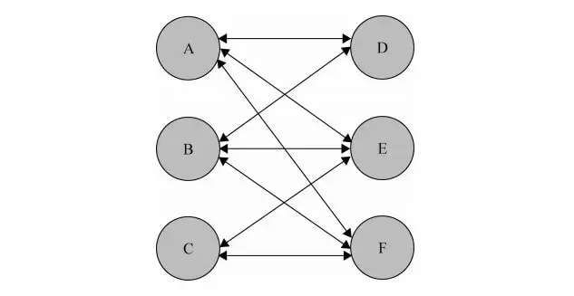
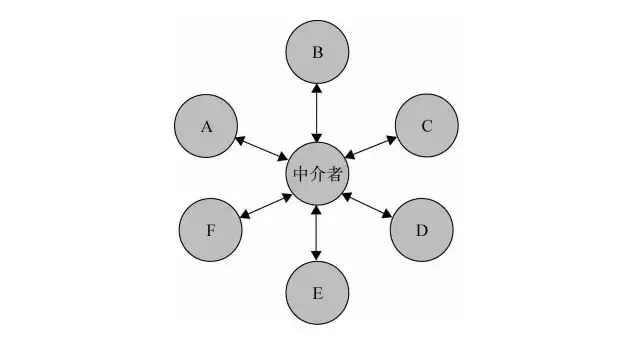

> 中介模式定义了一个单独的（中介）对象，来封装一组对象之间的交互。将这组对象之间的交互委派给与中介对象交互，来避免对象之间的直接交互。

在实际的项目中，程序由许多对象组成，对象间的交流错综复杂。



随着应用程序的规模增大，对象越来愈多，他们之间的关系也越来复杂。对象间很容易出现相互引用而导致程序无法运行。同时开发者需要改变或者删除某一个对象时候，需要查找并且改造所有引用到它的对象。这样一来，改造的成本会变的非常高。

但中介者模式可以让各个对象之间得以解耦。



之前的场景下，如果 A 发生了改变，开发者需要修改 B、D、E、F 4 个对象，而通过中介者模式，我们只需要修改中介者这一个对象即可。

中介者的好处是简化了对象之间的交互，坏处则是中介类有可能会变成大而复杂的“上帝类”（God Class）。所以，在使用中介者模式时候，设计上一定要非常克制。

## 实际使用

在前端项目开发的过程中，有很多业务无关的功能，但这些功能会散落在各个业务中，难以管理，我们利用中介者模式的思想来构建一个的控制器。

### 基础控制器

```typescript
// axios 请求工具
import axios from "axios";

// mitt 微型发布订阅工具
import mitt from "mitt";

const createApi = ($controller) => {
  const api = axios.create({
    baseURL: "/api",
    timeout: 10000,
  });

  api.interceptors.request.use(() => {
    // 可以通过 $controller.tmpCache 缓存一些数据
  });

  return api;
};

const createBus = () => mitt();

class Controller {
  // 临时缓存，也可以添加更复杂的缓存
  tmpCache: Record<string, any> = {};
  // 事件总线
  bus = createBus();

  constructor() {
    this.api = createApi(this);
  }

  static instance: Controller | null = null;

  static getInstance() {
    if (!Controller.instance) {
      Controller.instance = new Controller();
    }
    return Controller.instance;
  }
}

export default Controller;
```

此时控制器中有一个极简的缓存 tmpCache，发布订阅工具。以及服务端请求方法 api。开发者只需要导入 Controller 类即可使用。如果后续需要更加复杂的缓存或者改造 api（如切换为 fetch）请求方法。开发者可以很快的进行替换。而无需改造对应文件。

```typescript
import axios from "redaxios";

const createApi = ($controller) => {
  const api = axios.create({
    baseURL: "/api",
  });

  const getOld = api.get;

  api.get = (...params) => {
    // 如果出发缓存直接返回
    // if (xxx) {
    //   return $controller.tmpCache
    // }
    return getOld(...params);
  };

  return api;
};
```

### 添加用户类

登录的用户信息以及对应操作可以说是对象交互的核心，将其放入控制器中。

```typescript
class User {
  readonly $controller: Controller;
  user: User | null = null;

  constructor($controller: Controller) {
    this.$controller = $controller;
  }

  getData(key?: string) {
    return key ? this.user[key] : this.user;
  }

  // 登录
  login(params) {
    $controller.api.post("/login", params).then((response) => {
      // 处理授权以及 user 信息
    });
  }

  // 退出
  logout() {
    $controller.api.post("/logout").then(() => {
      // 清理对应数据
      $controller.tmpCache = {};
      this.user = null;
    });
  }

  // 设置用户配置
  setSetting(params) {
    return $controller.api.post("/setting", params).then(() => {
      this.user.setting = params;
    });
  }
}

class Controller {
  constructor() {
    this.api = createApi(this);
    this.user = new User(this);
  }

  logout() {
    this.user.logout();
  }
}
```

此时控制器已经具备前端开发中“大部分”功能了，如数据缓存，数据请求，登录用户信息处理等。大部分情况下，中介类也基本够用了。至于其他的工具类，除非 80% 的业务都会用到，否则不建议添加到此类中去。但对于这些工具做一层简单的封装也是必要的（考虑后续成本）。

### 添加业务类

此时控制器有了用户信息，多种缓存，请求方法等。我们可以通过注入来实现其他业务。

```typescript
class BasicService {
  constructor($controller) {
    this.api = $controller.api;
    this.bus = $controller.bus;
  }
}

class OrderService extends BasicService {
  static xxxKey = "xxxx";

  constructor($controller) {
    super($controller);
    // 使用全局缓存
    this.cache = $controller.xxxCache;
    // 或者构建一个新的 cache 挂载到 controller 上
    this.cache = $controller.getCreatedCache("order", XXXCache);
  }

  getOrders = async () => {
    if (this.cache.has(OrderService.xxxKey)) {
      return this.cache.get(OrderService.xxxKey);
    }
    let orders = await this.api.get("xxxxx");

    // 业务处理，包括其他的业务开发
    order = order.map();

    this.cache.set(OrderService.xxxKey, orders);

    // 可以发送全局事件
    this.bus.emit("getOrdersSuccess", orders);

    return orders;
  };

  clear() {
    // 如果构建一个新的缓存对象，直接 clear 即可 this.cache.clear();
    this.cache.delete(OrderService.xxxKey);
  }
}

class Controller {
  // 临时缓存，也可以添加更复杂的缓存
  tmpCache: Record<string, any> = {};
  // 事件总线
  bus = createBus();

  services: Record<string, BasicService> = {};

  getService(serviceCls) {
    // 同一个类 name 为相同的名称
    const { name } = serviceCls;
    if (!this.services[name]) {
      this.services[name] = new serviceCls(Controller.instance);
    }
    return this.services[name];
  }
}
```

开发者可以在具体的代码中这样使用。

```typescript
import Controller from "../../controller";
import OrderService from "./order-service";

// A 页面
const orderService = Controller.getInstance().getService(OrderService);
const priceService = Controller.getInstance().getService(PriceService);

// B 页面都会使用同一个服务
const orderService = Controller.getInstance().getService(OrderService);
```

有同学可能会奇怪，为什么 Controller 不能直接导入或者自动注入 OrderService 呢。这样使用的原因是往往 Controller 和 BasicService 在基础类中，具体的业务类分布在各个业务代码中。

这里没有使用任何依赖注入的框架，原因是因为如果引入了依赖注入会大大增加复杂度。同时前端的业务都是分散的，没有必要都放在一起。在组件需要使用到服务候才将其装载起来。