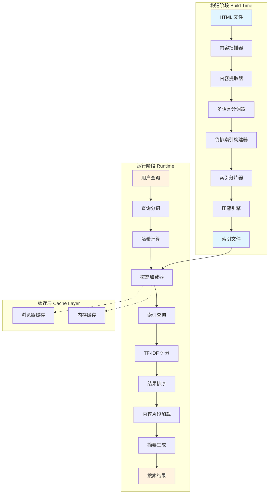
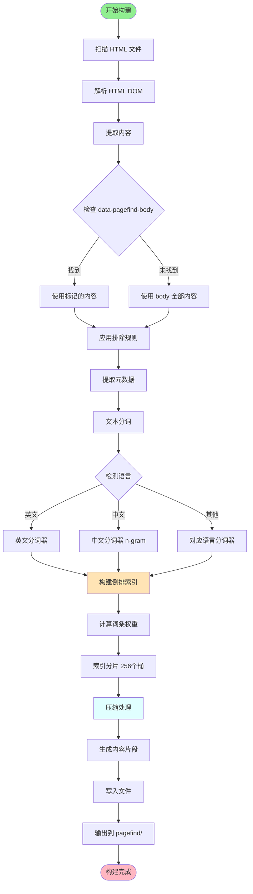
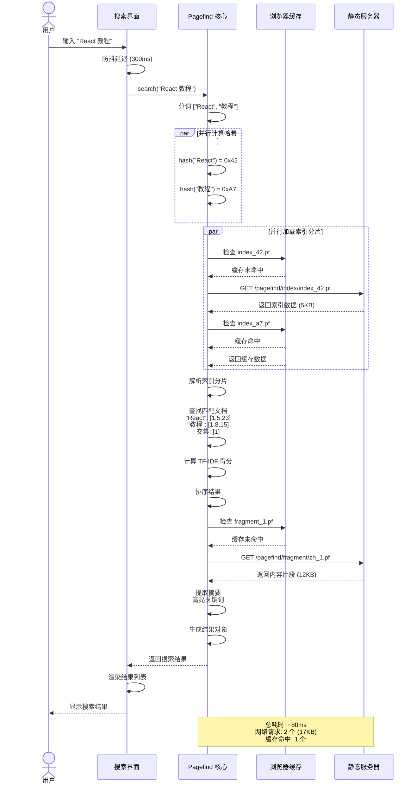
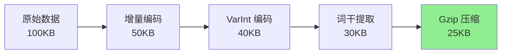
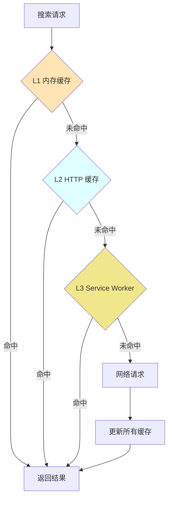

Pagefind 是一个专为静态网站设计的开源搜索引擎，它能够自动索引你的网站并提供完全离线的搜索体验。

### 核心特性

- **按需加载**：只下载搜索相关的内容片段，而不是整个索引
- **轻量级**：核心 JS 仅约 20KB，索引文件高度压缩（相比 Lunr.js 减少 85%）
- **零配置**：自动识别内容，开箱即用
- **多语言支持**：内置中文、日文等多语言分词器
- **完全静态**：无需服务器端支持，支持完全离线

## 快速上手

### 三步启用搜索

```bash
# 1. 构建你的静态网站
npm run build

# 2. 生成搜索索引
npx pagefind --source "dist"

# 3. 在 HTML 中添加搜索界面
```

```html
<link href="/pagefind/pagefind-ui.css" rel="stylesheet">
<div id="search"></div>
<script src="/pagefind/pagefind-ui.js"></script>
<script>
    new PagefindUI({ element: "#search" });
</script>
```

Pagefind 会自动在 `dist/pagefind/` 目录下生成索引文件。

## 核心用法

### 控制索引范围

使用 `data-pagefind-body` 标记要索引的内容：

```html
<main data-pagefind-body>
    <h1>文章标题</h1>
    <p>这部分内容会被索引</p>
</main>

<!-- 使用 data-pagefind-ignore 排除特定内容 -->
<div data-pagefind-ignore>
    <h2>评论</h2>
    <div class="comments">...</div>
</div>
```

### 添加元数据和权重

```html
<!-- 自定义元数据 -->
<article data-pagefind-body
         data-pagefind-meta="author:张三,date:2024-01-01">
    <h1 data-pagefind-weight="10">文章标题</h1>
    <p data-pagefind-weight="5">摘要内容...</p>
    <div>正文内容...</div>
</article>
```

### 配置文件

```yaml
# pagefind.yml
source: "dist"
exclude_selectors:
  - "nav"
  - ".sidebar"
force_language: "zh-cn"
```

### 自定义搜索 UI

```javascript
import * as pagefind from '/pagefind/pagefind.js';

const search = await pagefind.search("React");
const results = await Promise.all(
    search.results.map(r => r.data())
);
```

## 实战指南

### 集成到构建流程

```json
{
  "scripts": {
    "build": "vite build",
    "postbuild": "pagefind --source dist"
  }
}
```

### React 自定义搜索组件

```jsx
import { useState } from 'react';

function Search() {
    const [results, setResults] = useState([]);

    const handleSearch = async (e) => {
        const { default: pagefind } = await import('/pagefind/pagefind.js');
        const search = await pagefind.search(e.target.value);
        const data = await Promise.all(
            search.results.slice(0, 5).map(r => r.data())
        );
        setResults(data);
    };

    return (
        <>
            <input type="search" onChange={handleSearch} />
            {results.map((r, i) => (
                <a key={i} href={r.url}>
                    <h3>{r.meta.title}</h3>
                    <p dangerouslySetInnerHTML={{ __html: r.excerpt }} />
                </a>
            ))}
        </>
    );
}
```

### 最佳实践

**1. 只索引主要内容**
```html
<!-- ✅ 推荐 -->
<main data-pagefind-body>
    <article>...</article>
</main>
```

**2. 使用权重优化结果**
```html
<h1 data-pagefind-weight="10">标题</h1>
<p data-pagefind-weight="5">摘要</p>
```

**3. CLI 参数配置**
```bash
# 排除选择器
pagefind --source "dist" --exclude-selectors "nav" --exclude-selectors "footer"

# 强制语言
pagefind --source "dist" --force-language "zh-cn"
```

## 配置参考

### HTML 属性

| 属性 | 说明 |
|------|------|
| `data-pagefind-body` | 标记要索引的主要内容区域 |
| `data-pagefind-ignore` | 排除该元素及其子元素 |
| `data-pagefind-meta` | 添加自定义元数据 |
| `data-pagefind-filter` | 定义可过滤的字段 |
| `data-pagefind-sort` | 定义可排序的字段 |
| `data-pagefind-weight` | 设置内容权重（1-10） |

### JavaScript API

```javascript
// 高级搜索
const search = await pagefind.search("React", {
  filters: { category: "tutorial" },
  sort: { date: "desc" },
  limit: 10
});

// 获取结果
const results = await Promise.all(
  search.results.map(r => r.data())
);
```

## 原理深度解析

### 整体架构

首先通过架构图了解 Pagefind 的整体设计：



### 索引构建过程

Pagefind 的工作流程可以分为两个阶段：**构建时索引**和**运行时搜索**。

#### 1. 构建时索引（Build Time）

当你运行 `pagefind --source "dist"` 时，Pagefind 会执行以下步骤：



**关键技术点：**

- **倒排索引**：对于每个词条，记录它出现在哪些文档的哪些位置
- **分片存储**：将索引拆分成小块，按需加载（使用一致性哈希算法分配到 256 个桶）
- **压缩算法**：使用高效的压缩减少文件大小

**索引结构详解：**

```
pagefind/
├── pagefind.js           # 核心搜索引擎（~20KB）
│                         # - 包含哈希函数
│                         # - 索引加载器
│                         # - 搜索算法
│
├── pagefind-ui.js        # UI 组件（~15KB）
├── pagefind-ui.css       # 样式文件（~3KB）
│
├── index/                # 索引分片（256 个）
│   ├── index_00.pf       # 哈希值 0x00-0x00
│   ├── index_01.pf       # 哈希值 0x01-0x01
│   ├── ...
│   └── index_ff.pf       # 哈希值 0xFF-0xFF
│
├── fragment/             # 内容片段
│   ├── en_<hash>.pf      # 英文页面片段
│   ├── zh_<hash>.pf      # 中文页面片段
│   └── ...
│
└── filter/               # 过滤器数据（如果使用）
    ├── category.pf
    └── tags.pf
```

#### 2. 运行时搜索（Runtime）

当用户输入搜索查询时的完整时序：



**性能分析：**

| 阶段 | 耗时 | 说明 |
|------|------|------|
| 用户输入 + 防抖 | 300ms | 等待用户完成输入 |
| 分词 + 哈希计算 | <5ms | 纯计算，无 I/O |
| 加载索引分片 | 20-50ms | 取决于网络和缓存 |
| 索引查询 + 评分 | 5-10ms | 纯内存操作 |
| 加载内容片段 | 15-30ms | 取决于网络和缓存 |
| 摘要生成 + 渲染 | 5-10ms | DOM 操作 |
| **总计（首次）** | **~80ms** | 不含防抖延迟 |
| **总计（缓存）** | **~25ms** | 索引和片段均已缓存 |

### 核心技术解析

#### 1. 按需加载机制

Pagefind 最大的创新是**渐进式加载**。传统的客户端搜索（如 Lunr.js）需要加载完整索引：

```javascript
// 传统方案：需要加载整个索引
// 假设网站有 1000 个页面，索引文件可能有 5MB
await loadFullIndex(); // 加载 5MB
search("React");
```

Pagefind 的方案：

```javascript
// Pagefind：按需加载
search("React");
// 1. 根据 "React" 计算哈希 -> 只加载包含 "React" 的索引分片（可能只有 10KB）
// 2. 找到匹配的文档 ID
// 3. 只加载这些文档的内容片段（可能 20KB）
// 总共只需要下载 30KB，而不是 5MB
```

**实现原理：**

```
查询词 "React"
    ↓
计算哈希：hash("React") = 0x3A7F
    ↓
确定分片：0x3A7F % 256 = 127
    ↓
加载：GET /pagefind/index/index_127.pf
    ↓
解析分片，找到文档 ID: [5, 23, 87]
    ↓
加载内容：GET /pagefind/fragment/en_005.pf
```

#### 2. 倒排索引结构

倒排索引是搜索引擎的核心数据结构：

```
正向索引（文档 → 词条）：
文档1: ["React", "教程", "入门"]
文档2: ["Vue", "教程", "进阶"]
文档3: ["React", "进阶", "Hooks"]

倒排索引（词条 → 文档）：
"React"  → [文档1, 文档3]
"Vue"    → [文档2]
"教程"   → [文档1, 文档2]
"入门"   → [文档1]
"进阶"   → [文档2, 文档3]
"Hooks"  → [文档3]
```

当搜索 "React 教程" 时：
1. 查找 "React" → [文档1, 文档3]
2. 查找 "教程" → [文档1, 文档2]
3. 取交集 → [文档1]

#### 3. TF-IDF 相关性评分

Pagefind 使用 TF-IDF 算法计算搜索结果的相关性：

**TF（词频）**：词条在文档中出现的频率
```
TF(t, d) = 词条 t 在文档 d 中出现的次数 / 文档 d 的总词数
```

**IDF（逆文档频率）**：词条的稀有程度
```
IDF(t) = log(总文档数 / 包含词条 t 的文档数)
```

**TF-IDF 得分**：
```
TF-IDF(t, d) = TF(t, d) × IDF(t)
```

**示例计算：**

假设我们有 100 个文档，搜索 "React Hooks"：

```
文档A：
- "React" 出现 10 次，文档总词数 100
  TF("React", A) = 10/100 = 0.1
  包含 "React" 的文档有 30 个
  IDF("React") = log(100/30) = 0.52
  TF-IDF("React", A) = 0.1 × 0.52 = 0.052

- "Hooks" 出现 5 次
  TF("Hooks", A) = 5/100 = 0.05
  包含 "Hooks" 的文档有 5 个
  IDF("Hooks") = log(100/5) = 1.30
  TF-IDF("Hooks", A) = 0.05 × 1.30 = 0.065

文档A 总分 = 0.052 + 0.065 = 0.117
```

"Hooks" 更稀有，所以权重更高。

#### 4. 多语言分词

Pagefind 内置了多种语言的分词器：

**英文分词**（基于空格和标点）：
```
"Hello, world!" → ["hello", "world"]
```

**中文分词**（基于字典和统计）：
```
"自然语言处理" → ["自然", "语言", "处理"]
或 → ["自然语言", "处理"]
或 → ["自然语言处理"]
```

Pagefind 使用 **n-gram** 技术处理 CJK 文本：
```
"搜索引擎" → ["搜索", "搜索引", "搜索引擎", "索引", "索引擎", "引擎"]
```

这样即使查询 "搜索" 或 "引擎"，也能匹配到 "搜索引擎"。

### 性能优化技术

Pagefind 通过多种技术实现高性能：

**索引压缩**（原始 10MB → 500KB，压缩率 95%）：
- 去除 HTML 标签和属性
- 词干提取（stemming）："running" → "run"
- 停用词过滤（去除 "the", "a", "is" 等常见词）
- 增量编码 + Gzip 压缩

**并行加载**：
支持 HTTP/2 多路复用，多个词条的索引分片并行加载，总耗时 = max(单个加载时间)。

### 技术内幕深度剖析

#### 1. 核心算法实现

Pagefind 是用 Rust 编写并编译为 WASM，核心逻辑包括：

**哈希计算**（FNV-1a 算法）：
```javascript
// 词条归一化（转小写、去除特殊字符）→ FNV-1a 哈希 → 映射到 0-255
hash("React") = 0x42 (66)
hash("react") = 0x42 (66)  // 大小写不敏感
```

**索引加载器**：
1. 计算词条哈希 → 确定分片编号
2. 检查内存缓存 → 未命中则加载对应的 .pf 文件
3. 解析二进制格式 → 存入缓存
4. 返回词条对应的文档 ID 列表

**TF-IDF 评分器**：
```javascript
// 计算每个文档的相关性得分
score = Σ(TF × IDF × weight) × lengthNorm
// - TF: 词频
// - IDF: 逆文档频率（缓存优化）
// - weight: 自定义权重
// - lengthNorm: 长度归一化（防止长文档占优）
```

#### 2. .pf 文件格式

Pagefind 使用自定义的 `.pf`（Pagefind Format）二进制格式：

**索引文件（index_XX.pf）**：
- Header：Magic Number (0x5046 'PF') + 版本 + 标志 + 条目数
- Entries：每个词条 → 文档 ID 列表（增量编码）

示例：`"React" → [1, 5, 23]` 存储为 `[1, +4, +18]`

**内容片段（fragment_XX.pf）**：
- Header：Magic Number + 压缩类型 + 文档 ID + 长度
- Metadata：JSON 格式（title, url, excerpt 等）
- Content：原始文本 + 词条位置映射

#### 3. 四层压缩策略



**Level 1: 增量编码（Delta Encoding）**
- 文档 ID `[1, 5, 23, 45]` → `[1, +4, +18, +22]`
- 节省 50% 存储空间

**Level 2: 变长整数编码（VarInt）**
- 小数字用 1 字节，大数字自动扩展
- `1 → [0x01]`，`128 → [0x80, 0x01]`

**Level 3: 词干提取（Stemming）**
- "running", "runs", "runner" → "run"
- 减少唯一词条数量 30-40%

**Level 4: Gzip 压缩**
- 文本压缩率 60-80%
- 最终实现 95% 总压缩率

#### 4. 三层缓存架构



| 缓存层级 | 命中延迟 | 容量 | 适用场景 |
|---------|---------|------|---------|
| **L1 内存缓存** | <1ms | ~10MB | 频繁访问的索引（LRU 淘汰） |
| **L2 HTTP 缓存** | ~5ms | ~100MB | 已访问的所有索引（Cache-Control） |
| **L3 Service Worker** | ~10ms | ~50MB | 离线访问（可选） |
| **网络请求** | 50-200ms | - | 首次访问 |

**性能提升**：
- 首次搜索：~80ms
- 后续搜索（缓存命中）：~25ms
- 离线模式：~25ms

**服务器配置**（Nginx）：
```nginx
location /pagefind/ {
    add_header Cache-Control "public, max-age=31536000, immutable";
    gzip on;
}
```

## 性能对比

| 方案 | 初次加载 | 索引大小 (1000页) | 搜索速度 | 离线支持 |
|------|---------|------------------|---------|---------|
| **Pagefind** | ~20KB | ~500KB | <50ms | ✅ |
| Algolia | 0 (CDN) | N/A | <10ms | ❌ |
| Lunr.js | ~30KB | ~3MB | ~100ms | ✅ |

**实际数据**（500 页文档网站）：
- 首次搜索：下载 45KB，耗时 ~80ms
- 后续搜索：下载 10KB，耗时 ~25ms
- 对比 Lunr.js：减少 97% 的下载量

## 常见问题

**Q: Pagefind 与 Algolia 如何选择？**
- Pagefind：中小型网站（< 10,000 页）、免费、离线支持、重视隐私
- Algolia：大型网站、高级功能、极致速度、付费

**Q: 支持哪些框架？**
框架无关，支持 VitePress、Docusaurus、Hugo、Jekyll、Astro、Next.js（SSG）等任何生成 HTML 的工具。

**Q: 是否影响 SEO？**
不影响。Pagefind 的搜索 UI 是客户端渲染的，原始 HTML 内容完全不受影响。

**Q: 如何更新索引？**
每次构建时重新生成索引。在 CI/CD 中使用 `postbuild` 脚本自动化。

## 总结

Pagefind 为静态网站提供了轻量、高性能的搜索方案：

- ✅ **轻量级**：核心 20KB，按需加载
- ✅ **高性能**：搜索响应 < 50ms
- ✅ **零配置**：开箱即用
- ✅ **完全静态**：无需服务器，支持离线
- ✅ **多语言**：内置 CJK 分词

### 核心原理

1. **倒排索引 + 分片**：将索引拆分成 256 个小块
2. **按需加载**：根据查询词哈希值只加载相关分片
3. **TF-IDF 评分**：计算相关性智能排序
4. **多语言分词**：支持中英文等智能分词

## 相关资源

- 官方文档：https://pagefind.app/docs/
- GitHub：https://github.com/CloudCannon/pagefind
