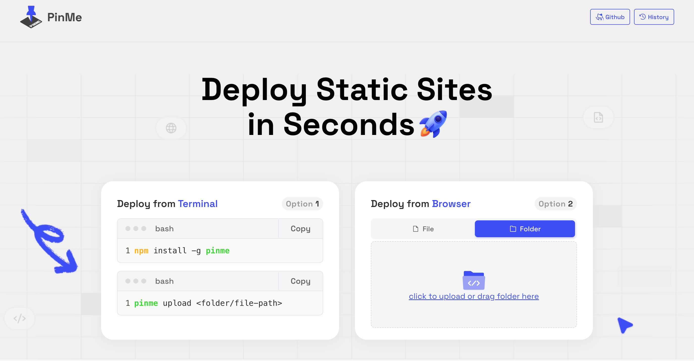

## PinMe 简介

### 什么是 PinMe？

PinMe 是一个免费的 IPFS 托管平台，专为静态网站部署设计。它能让开发者在几秒钟内将网站部署到 IPFS 网络上，确保内容的持久性和抗审查能力。

PinMe 的核心价值是提供简单、快速、免费的前端部署体验，让开发者专注于内容创作。

### 为什么选择 PinMe？

相比传统托管服务，PinMe 具有以下优势：

- **完全免费**：无需支付服务器费用或订阅费用
- **去中心化**：内容存储在 IPFS 网络上，不依赖单一公司服务器
- **内容自主权**：用户完全掌控自己的内容，无平台锁定风险
- **抗审查性强**：内容不易被单方面删除
- **全球加速**：通过点对点网络优化全球访问速度

### 适用场景

PinMe 适用于以下场景：

- 个人博客和作品集
- 开源项目文档
- 原型设计展示
- 小型企业网站
- 实验性项目

## 快速上手

### 部署方式

#### 终端部署

使用 PinMe CLI 工具部署网站：

**安装 PinMe CLI**

```bash
npm install -g pinme
```

**部署静态网站**

```bash
pinme upload <folder/file-path>
```

其中 `<folder/file-path>` 是要部署的静态网站文件夹或文件路径。

#### 浏览器部署

PinMe 也支持通过网页直接上传文件：



[查看部署示例](https://bafkreig4e45reibcazdpcd3aprpi7g4yxymunntk3bquxlw2e2av5cxcoy.pinme.dev/)

### 使用指南

#### 项目准备

部署前确保项目满足以下要求：

- 必须是静态网站（HTML、CSS、JavaScript、图片等）
- 不包含服务器端代码
- 推荐使用相对路径引用资源
- 使用框架的项目需先构建生成静态文件

#### 常见框架部署

```bash
# React 项目
npm run build
pinme upload build/

# Vue 项目
npm run build
pinme upload dist/

# Angular 项目
ng build
pinme upload dist/
```

#### 自定义域名

为网站设置自定义域名：

1. 获取网站的 IPFS CID
2. 在域名注册商处设置 DNS 记录：
   - 添加 CNAME 记录指向 PinMe 的 IPFS 网关
   - 或使用 DNSLink（推荐）
3. 详情参考 [IPFS 官方文档](https://docs.ipfs.tech/how-to/websites-on-ipfs/link-a-domain/#option-1-use-a-dns-link)

## 工作原理

### 工作流程

PinMe 基于 IPFS 协议工作，流程如下：

1. **内容哈希生成**：上传文件时，为每个文件生成唯一的 IPFS 内容标识符（CID）
2. **内容固定**：将内容固定在 IPFS 网络上，防止被垃圾回收
3. **内容分发**：分发到多个节点，提高可用性和访问速度
4. **访问路由**：提供从域名到 IPFS 内容的解析服务

### 技术架构

PinMe 的技术架构包括：

- **客户端工具**：CLI 和 Web 上传界面
- **IPFS 网关**：连接用户与 IPFS 网络
- **内容固定服务**：确保内容长期存在
- **域名解析服务**：提供域名到 CID 的解析

## IPFS 基础知识

### 什么是 IPFS？

IPFS（星际文件系统）是一个开源的点对点分布式文件系统，旨在创建持久且分布式的 Web。它使用基于内容寻址的方法，每个文件由其内容的哈希值标识。

### 核心概念

- **内容寻址**：使用内容的哈希值（CID）标识文件，相同内容只存储一次
- **分布式存储**：文件分布在网络的多个节点上，提高可用性
- **版本控制**：每次修改生成新 CID，支持历史版本追踪
- **内容固定**："固定"内容防止被垃圾回收

### 工作原理

文件添加到 IPFS 的过程：

1. 文件被分割成固定大小的块
2. 每个块生成唯一哈希值
3. 块被组织成有向无环图（DAG）
4. 整个文件结构的根哈希作为文件的 CID

访问 CID 时，IPFS 网络会：
1. 在本地节点查找内容
2. 本地没有则在网络中查找持有内容的节点
3. 从节点获取内容并返回给用户
4. 在本地缓存内容，加速未来访问

## 总结

PinMe 为开发者提供了简单、快速、免费的静态网站去中心化托管解决方案。通过 IPFS 技术，实现了内容的持久性、抗审查性和全球分发能力。

随着 Web3 发展，去中心化存储将越来越重要。PinMe 作为实用工具，为开发者提供了探索 Web3 的便捷入口。