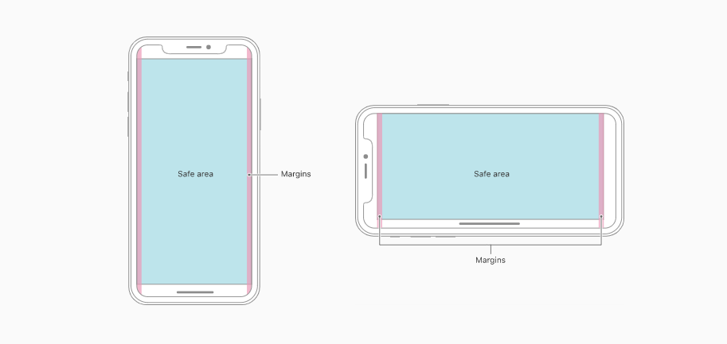

去年 11 月份中旬，随着有赞 Vant Weapp 库 1.0 版本的正式发布，我们的小程序也是立即跟随官方的脚步，着手把依赖库升级了一下。但是却发现 Vant Weapp 对于苹果的底边适配却在微信开发者工具中消失了。在不了解 css env 实际作用和开发工具适配的的情况下，就鲁莽的发了一个 [issue](https://github.com/youzan/vant-weapp/issues/2264)，在此也记录一下，以便于今后查阅与学习。

## safe-area

事实上，因为个人之前工作的重心在了 js 与 pc 上，对 css 以及移动端有所忽略，才会对这个安全区域没有更多的学习以及理解。



面对新式手机的刘海以及胡子，在开发移动端的小伙伴们不得不对手机型号做适配，如果当前使用的界面是整个屏幕，就会发生当前的显示被遮挡的问题。当然，其实对于小程序来说，绝大情况下完全不用考虑上面的刘海，一方面是因为当前的小程序的 navigationBar 做到了适配的功能，不需要考虑头部的问题。从另一方面来说，小程序没有特别的需求下也不需要横屏展示。但是对于底部的胡子，我们需要留给其 34px 的高度。在 1.0 版本之前，Vant Weapp 的适配是这样的。

下面代码相对于源代码有所修改，但是基本逻辑是在组件中获取到当前的手机信息。

```ts
// 缓存数据
let cache = null;

// 获取有关安全区域的数据（有缓存得缓存）
function getSafeArea() {
  return new Promise((resolve, reject) => {
    if (cache != null) {
      resolve(cache);
    } else {
      wx.getSystemInfo({
        success: ({ model, statusBarHeight }) => {
          const deviceType = model.replace(/\s/g, '-');
          const iphoneNew = /iphone-x|iPhone11|iPhone12/i.test(deviceType);
		  
          cache = {
            isIPhoneX: iphoneNew,
            statusBarHeight
          };

          resolve(cache);
        },
        fail: reject
      });
    }
  });
}

// 提供对外的 函数调用
export const safeArea = ({
  safeAreaInsetBottom = true,
  safeAreaInsetTop = false
} = {}) =>
  Behavior({
    properties: {
      safeAreaInsetTop: {
        type: Boolean,
        value: safeAreaInsetTop
      },
      safeAreaInsetBottom: {
        type: Boolean,
        value: safeAreaInsetBottom
      }
    },
    lifetimes: {
      attached(): void {
        getSafeArea().then(({ isIPhoneX, statusBarHeight }) => {
          // 当前 data 中就有了判断数据 
          this.setData({ isIPhoneX, statusBarHeight });
        });
      }
    }
  });
```

Behavior 等同于 Vue 中的 mixin, 提供了 isIPhoneX 这个数据，我们也把该代码拷贝了出来以便于在业务中使用。具体可以参考 [Component 构造器](https://developers.weixin.qq.com/miniprogram/dev/framework/custom-component/component.html) 来方便小程序本身的开发。

## env

我们为了得到可用空间 safe-area 不得不写了大量的 js 代码来判断当前的手机型号，然后再在 wxml 中通过数据驱动来添加 css。单从代码维护性上来看，为了处理 safe-area, 我们做了一些非必要的耦合，也增加了代码的复杂度。当前代码也不能处理将来可能会有的更多手机型号。

所以，浏览器提供了另外的函数 env 来帮助我们处理这一切，不过在此之前，我们要通过 meta 来让网页使用整个屏幕。

```html
<meta name='viewport' content='viewport-fit=cover'>
```

刚开始，我拿到这个也是一脸懵逼，不是说要使用安全区域吗，为什么在此之前却要平铺整个页面呢？后来查阅资料才知道，如果没有该属性，当前的屏幕就会上面和底部的安全区域呈现出白条,非常的木有用户体验。


事实上，保留安全区，浏览器已经帮我们做好了，但是我们肯定不能满足于如上所示的样式。如果让我来出设计的话，我可能就直接把网页分成多分，然后各自写css 样式。但是那群大佬不是这样考虑的，他们直接让你把页面填满，然后再提供变量让你对网页的区域做功课。

viewport-fit 出现的本意是对智能手表进行网页显示的适配，但是却被苹果公司先用在了 iPhone X 上(纵观 css 的历史，就会发现目前我们在业务中使用的很多功能原来的意图根本不是为了解决当前问题)。

在告知了浏览器使用整个屏幕后，我们就可以结合 env 来做适配了。在不兼容 env() 的浏览器中，会自动忽略规则。

```css
/* 使用 safe-area-inset 来对应 竖屏的 top和 bottom，以及横屏的 left 和 right*/
env(safe-area-inset-top);
env(safe-area-inset-right);
env(safe-area-inset-bottom);
env(safe-area-inset-left);

/* 如果当前浏览器没有提供 safe-area-inset-top，那就回退使用 20px */
env(safe-area-inset-top, 20px);
env(safe-area-inset-right, 1em);
env(safe-area-inset-bottom, 0.5vh);
env(safe-area-inset-left, 1.4rem);

.console {
  padding: 12px;
  padding-left: env(safe-area-inset-left);
  padding-right: env(safe-area-inset-right);
}
```

任何一个提案都不是一蹴而就的，在 ios 11 时候，我们是使用 constant 来控制的，如果为了兼容，我们就必须使用如下代码:

```css
.console {
  /* iOS 11.0 */
  padding-bottom: constant(safe-area-inset-bottom);
  /* iOS 11.2 */
  padding-bottom: env(safe-area-inset-bottom);
}
```

当然，constant 这个单词我认为是命名上的一种“失误”，它在命名上对应的应该是css var,但是在功能上却并无此意义。而 env 是更符合当前语义的。我也有理由相信，今后的 env 可以提供更多的变量来辅助开发。


## 参考文档

[Designing Websites for iPhone X](https://webkit.org/blog/7929/designing-websites-for-iphone-x/)

[MDN viewport-fit](https://developer.mozilla.org/en-US/docs/Web/CSS/@viewport/viewport-fit)

https://drafts.csswg.org/css-env-1/#normative

[css env](https://drafts.csswg.org/css-env/)

[兼容iphone x刘海的正确姿势](https://juejin.im/post/5be95fbef265da61327ed8e0)