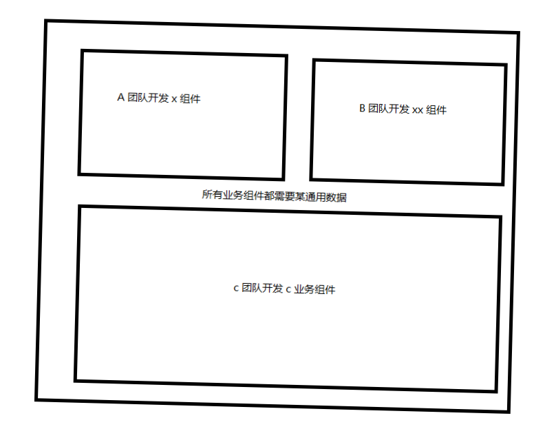
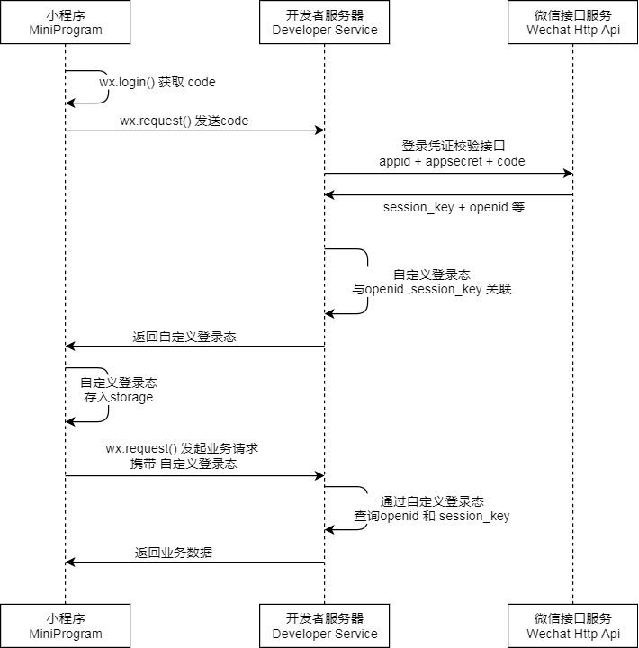

9012 年末，作为一个前端，说不了解 Promise 对象用法的基本不存在，这里就不对功能用法进行介绍了。但本文将会讲述你可能不知道的 Promise 3 种奇妙用法。当然，每种用法都会有其适用的特殊场景。

## Promise 对象是可以缓存

### 需求

对于一个对象而言，能够被缓存并不是一件难以理解的事情。缓存使用的意义往往是为了解决性能问题。而对于一个特定请求的 Promise 对象而言，缓存的意义在于同时多个组件的使用该请求，会因为请求未返回而进行多次请求。一图胜千言，图示如下:



因为在某些特定需求或者场景下(甚至因为团队的因素)，某个组件在可以在页面单独使用，也可以结合其他组件共同使用。若此时多个组件都需要对某个通用数据进行请求，就会发生多次请求，对性能不利。但如果全部移植到父组件去请求，又是需要一顿操作，对开发不爽。

### 解决方案

所以这时候我们基于 api 与 请求参数加缓存。先写一个生成 key 的函数(此函数仅仅只适用简单的请求参数，不适合对象等复杂数据结构，因为是通用型数据，不考虑太复杂的请求参数，如有需求可以自行改造)。

```js
// 生成key值错误
const generateKeyError = new Error("Can't generate key from name and argument")

// 根据当前的请求参数生成 key 值
function generateKey(name, argument) {
    // 从arguments 中取得数据然后变为数组
    const params = Array.from(argument).join(',')
    
    try{
        // 返回 字符串，函数名 + 函数参数
        return `${name}:${params}`
    }catch(_) {
        // 返回生成key错误
        return generateKeyError
    }
}
```

下面是数据请求缓存，不过令人觉得可惜的是: 数据请求缓存并不能解决多次请求的问题。

```js
const dataCache = new Map()

async getxxx(params1, params2) {
   const key = generateKey('getxxx', [params1, params2]) 
    // 从data 缓存中获取 数据
    let data = dataCache.get(key)
    if (!data) {
        // 没有数据请求服务器
        const res = await request.get('/xxx')
        
        // 其他操作
        ...
        data = ...

        // 设置数据缓存
        dataCache.set(key, data)

    }
    return data
} 
```

因为虽然 js 是单线程的，所以在第二个以及以上的组件请求时候，会因为请求未返回而进行再次请求 api。流程如下:

- a 组件请求 
- dataCache.get == null 
- 建立请求(等待返回)
- 其他操作
- b 组件请求 
- dataCache.get == null   
- 建立请求(等待返回)
- 其他操作 
-  .... ...
- 放入缓存且返回数据
- 放入缓存且返回数据
- .... ...

如果缓存的是 Promise 对象，则该方案可以解决问题。

```js
const promiseCache  = new Map()

async getxxx(params1, params2) {
   const key = generateKey('getxxx', [params1, params2]) 
    // promiseCache 缓存中获取 缓存
    let xxxPromise = promiseCache.get(key);
    // 当前promise缓存中没有 该promise
    if (!xxxPromise) {
        xxxPromise = request.get('/getxxx').then(res => {
            // 对res 进行操作
            ...
        }).catch(error => {
            // 在请求回来后，如果出现问题，把promise从cache中删除 以避免第二次请求继续出错
            promiseCache.delete(key)
            return Promise.reject(error)
        })
        promiseCache.set(key, promise)
    }
    return xxxPromise
} 
```

流程如下:

- a 组件请求 
- promiseCache.get == null 
- 建立请求
- 返回 promise
- 其他操作
- b 组件请求 
- promiseCache.get != null   
- 返回 promise
- 其他操作 
-  .... ...

同时，因为 promise 是异步操作，所以在发生错误时候 catch 中去除缓存以便于缓存了错误的promise。

### 进一步了解与学习

该方案可以减轻同一时间多次请求同一数据所带来的性能问题。

如果你还想结合过期时间与装饰器来对缓存进行赋能，可以参考我之前的博客文章 [前端 api 请求缓存方案](https://segmentfault.com/a/1190000018940422)

## Promise 可以封装大量异步操作

### 需求

在写关于异步请求时候，通常是基于请求直接返回 api 请求响应数据，对其进行正常和错误处理。当时多次异步操作从而返回正确与错误的流程却很少进行梳理。如果在一次请求内有多个异步操作：代码就会变得难以维护。

### 解决方案

学习 Promise 时候，往往会与有限状态机结合在一起说，如果你实现过 Promise,你就清晰的知道: 如果内部没有状态没有发生变化，可以执行大量异步操作。体现为如果没有调用 resolve 或者 reject 函数，则不会对于当前 Promise 的状态和值进行修改，也就不会执行后面的链式调用。

```js
// 异步操作封装
function asyncOpt(opt: any) {
  return new Promise((resolve, reject) => {
    // 传入的 opt 异步操作
      
    // 如 请求失败，失败的逻辑判断后再次请求   
    // 又如多个 异步操作， 在最后一个异步操作成功后执行
      
    reslove(result)


    // 多个 异步操作中的 catch， 在每个错误中执行
    reject(error)
  })  
}


asyncOpt(data).then(result => {
  // 正常流程
}).catch(error => {
  // 错误流程
})

```

写出如上的代码，就可以在很多业务项内进行操作，诸如某些操作有前置权限请求，或者某些错误代码需要重新请求或者埋点等操作。

### 进一步了解与学习

如果觉得上述的例子不够复杂，不够体现出 Promise 封装的妙用，你可以研究关于微信登陆态的管理。事实上，在没有知道这种用法之前，确实没有很好的办法解决这种问题。



当然，github 上已经有了开源实践 [weRequest](https://github.com/IvinWu/weRequest)，该库实现了无感知登陆，且代码风格与结构非常值得学习，可以参考我之前的博客文章  [从 WeRequest 登陆态管理来聊聊业务代码](https://segmentfault.com/a/1190000020794315)。

同时，可以封装异步操作可并不仅仅只是指代异步请求，如果是你使用过Element，一定对如下代码不陌生。

```js
this.$confirm('此操作将永久删除该文件, 是否继续?', '提示', {
  confirmButtonText: '确定',
  cancelButtonText: '取消',
  type: 'warning'
}).then(() => {
   this.$message({
    type: 'success',
    message: '删除成功!'
   });
}).catch(() => {
   this.$message({
     type: 'info',
     message: '已取消删除'
   });          
});
```

这样的话，不需要再界面上写 confirm 以及一些控制显隐的代码，基于配置(字符串) 触发 promise 开始显示后销毁。

> 如果你完整引入了 Element，它会为 Vue.prototype 添加如下全局方法：$msgbox, $alert, $confirm 和 $prompt。因此在 Vue instance 中可以采用本页面中的方式调用 `MessageBox`。调用参数为：

- `$msgbox(options)`
- `$alert(message, title, options)` 或 `$alert(message, options)`
- `$confirm(message, title, options)` 或 `$confirm(message, options)`
- `$prompt(message, title, options)` 或 `$prompt(message, options)`

最后结合全局方法和 [渲染函数](https://cn.vuejs.org/v2/guide/render-function.html) 甚至也可以实现 Modal 配置化，传入组件，配置以及数据。可以类似于如下写法(当然,事实上用不用 Promise 都可以实现该方案，只不过 Promise 的状态转化很适合,与其自己实现一个状态机，倒不如使用promise):

```js
this.$modal(xxxComponent, componentConfig, propConfig).then(result => {
    // 根据不同返回结果来处理
}).catch(reason => {
    // 取消处理方法
})
// 甚至还可以加 finally 方法
```

## Promise 泄露触发转化方法

### 需求

最近有小伙伴来找我询问，如何解决后一个请求比前一个请求还要快，因为他写了输入实时查询的功能。我直接让他使用防抖函数，但是他告诉我他已经使用了 500ms 的防抖但是服务端仍旧是会存在问题。

本来考虑再前一个请求成功后再进行下一次，但是考虑到这个方案会慢点很明显，后面考虑请求唯一化，但是因为使用 axios 做请求库，该请求并不特殊，特殊化处理明显是增加了代码复杂度，也是不太好。

### 解决方案

后面他告诉我，他已经解决了此问题，因为 axios 有一个方法可以取消请求。也就是如果他进行下一个请求，便会取消上一个请求。下面代码是官方示例:

```js
const CancelToken = axios.CancelToken;
const source = CancelToken.source();

axios.get('/user/12345', {
  cancelToken: source.token
}).catch(function (thrown) {
  if (axios.isCancel(thrown)) {
    console.log('Request canceled', thrown.message);
  } else {
    // handle error
  }
});

axios.post('/user/12345', {
  name: 'new name'
}, {
  cancelToken: source.token
})

// cancel the request (the message parameter is optional)
source.cancel('Operation canceled by the user.');
```

其实我是知道 Promise 中是有 [cancelble 提案](https://github.com/tc39/proposal-cancelable-promises),但是该提案在第一阶段就因为被谷歌的强烈反对而取消了，那么我就去看 axios  源码来看一看如何实现取消。下面代码在 [xhr.js](https://github.com/axios/axios/blob/v0.19.0/lib/adapters/xhr.js) 中。

```js
// 如果配置出现 cancelToken
if (config.cancelToken) {
  // Handle cancellation
  // 设定 处理取消方法
  config.cancelToken.promise.then(function onCanceled(cancel) {
    // 请求被置空，直接返回，以避免出错
   	if (!request) {
      return;
    }
    // xhr.abort 取消请求
    request.abort();
    // 执行 reject  
    reject(cancel);
    // 请求置空
    request = null;
  });
}
```

先谈谈 abort 函数，abort 是 xhr 对象中的方法，根据 mdn :

> 如果该请求已被发出，**XMLHttpRequest.abort()** 方法将终止该请求。当一个请求被终止，它的 readyState 属性将被置为0（ `UNSENT` )。

这个请求指的是 http 请求，这样就会出现一个问题，基于http请求原理，当一个请求从客户端发出去之后，服务器端收到请求后，一个请求过程就结束了，这时就算是客户端abort这个请求，服务器端仍会做出完整的响应，只是这个响应客户端不会接收。所以实质上，后端还是处理了请求，但是前端不对该方法进行处理。

其中 promise  取消 核心代码如下 [CancelToken.js](https://github.com/axios/axios/blob/v0.19.0/lib/cancel/CancelToken.js)。

```js
function CancelToken(executor) {
  if (typeof executor !== 'function') {
    throw new TypeError('executor must be a function.');
  }
  // 设定 resolvePromise
  var resolvePromise;
    
  // xhr config.cancelToken.promise.then 就是当前的 promise 
  this.promise = new Promise(function promiseExecutor(resolve) {
    // 设定 和导出 resolve
    resolvePromise = resolve;
  });

  var token = this;
  executor(function cancel(message) {
    if (token.reason) {
      // Cancellation has already been requested
      return;
    }

      
    token.reason = new Cancel(message);
    // 执行 resolvePromise
    resolvePromise(token.reason);
  });
}

/**
 *  对应使用中	source
 *  axios.get('/user/12345', {
 *    cancelToken: source.token
 *	})
 *	source.cancel('Operation canceled by the user.');
 */
CancelToken.source = function source() {
  var cancel;
  // 返回 cancel token 对象  
  var token = new CancelToken(function executor(c) {
    // 利用 excutor 来把取消函数导出来。也就是 CancelToken excutor函数
    cancel = c;
  });
  return {
    token: token,
    cancel: cancel
  };
};
```

可以看到 axios 的代码关系还是有一定的复杂度。当然也是因为当前 Promise 没有办法像 setTimeout 等一些方法在调用时候直接返回取消函数，所以不得不借助另一个 promise 异步来处理。同时，也是把复杂度留给了自己，所以还是需要多读几遍。 调用关系如下。

CancelToken 设定了取消的  promise 调用关系， xhr 在有请求配置 cancelToken 的情况下，将当前请求注入的 cancelToken 中的 then 结合，使得调用了 cancel 后可以直接改变 xhr 内部状态。

### 进一步学习

当然在频繁的页面跳转，同时还有定时请求时候，跳转中的数据请求实际上意义不大: 可以参考 [vue axios请求 取消上一个页面所有请求 批量取消请求](https://blog.csdn.net/qq_24833847/article/details/82454762)

取消请求问题其实较为小众的，大部分是可以从请求源头来解决的，同时也因为对于服务端的处理并没有减轻，所以事实上不处理其实倒也没什么问题。但是其中也遇到过小程序中有一些全局的服务，在请求完成后由于触发不到页面数据而报错的问题。

虽然是小众问题，但是遇到该特定场景需要提供解决方案。

同时对于上面的异步操作组件来说，泄露出 resolve 和 reject 函数以便于直接执行 then 或者 catch 是否有意义，又或者中途改变异步组件的实现流程是否真的对业务有所帮助也是值得思考的。

## 参考

[Element confirm](https://element.eleme.cn/#/zh-CN/component/message-box#que-ren-xiao-xi)

[Vue 渲染函数](https://cn.vuejs.org/v2/guide/render-function.html) 

[axios](https://github.com/axios/axios)

[vue axios请求 取消上一个页面所有请求 批量取消请求](https://blog.csdn.net/qq_24833847/article/details/82454762)

