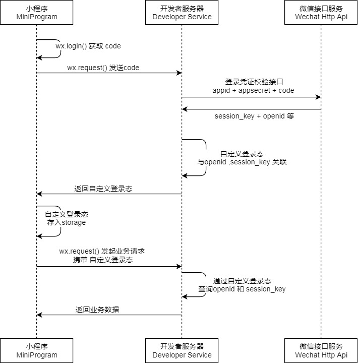

在开发微信小程序之前，个人从来没有接触过开发中涉及到第三方服务器交互的流程。在开发的过程本身倒是没有什么太大的意外，只是在维护服务器登陆状态这一点很讨厌。因为涉及到自身服务器的登录状态以及微信官方服务器登陆状态三方的关系。   


下图是微信登陆机制:




在这种场景下，个人非常关注的点在于: 如何能够无感知的进行登陆(并且无多余请求)。微信的登陆状态倒是还好解决，可以利用 wx.checkSession 来进行判定，但是在与后台服务器交互时候，如果后台交互中返回 HTTP 状态码 401 (未授权)或者其他未登陆指示时候。则需要对其进行额外处理。   

当时记得为了优雅的解决这个问题，想了很多方案，也与一些伙伴讨论过这个问题。虽然当时的确实现了无感知的登陆，但是要么需要多请求服务器，要么就是代码上实现逻辑过于复杂，代码维护。虽然不满意，但是在当时也没想到什么非常好的解决方法。

## weRequest 自带状态管理的请求组件

后面经过老大的介绍，看到这个组件时，我顿时眼前一亮，这正是我所需要的解决方案,该方案的图示如下:


只需要配置一些初始化项目，便可以直接拿去使用了。
```
// 导入
import weRequest from 'we-request';

weRequest.init({
    // [可选] 存在localStorage的session名称，且CGI请求的data中会自动带上以此为名称的session值；可不配置，默认为session
    sessionName: "session",
    // [可选] 请求URL的固定前缀；可不配置，默认为空
    urlPerfix: "https://www.example.com/",
    // [必填] 触发重新登录的条件，res为CGI返回的数据
    loginTrigger: function (res) {
        // 此处例子：当返回数据中的字段errcode等于-1，会自动触发重新登录
        return res.errcode == -1;
    },
    // [必填] 用code换取session的CGI配置
    codeToSession: {
        // [必填] CGI的URL
        url: 'user/login',
        // [可选] 调用改CGI的方法；可不配置，默认为GET
        method: 'GET',
        // [可选] CGI中传参时，存放code的名称，此处例子名称就是code；可不配置，默认值为code
        codeName: 'code',
        // [可选] 登录接口需要的其他参数；可不配置，默认为{}
        data: {},
        // [必填] CGI中返回的session值
        success: function (res) {
            // 此处例子：CGI返回数据中的字段session即为session值
            return res.session;
        }
    },
    // [可选] 登录重试次数，当连续请求登录接口返回失败次数超过这个次数，将不再重试登录；可不配置，默认为重试3次
    reLoginLimit: 2,
    // [必填] 触发请求成功的条件
    successTrigger: function (res) {
        // 此处例子：当返回数据中的字段errcode等于0时，代表请求成功，其他情况都认为业务逻辑失败
        return res.errcode == 0;
    },
    // [可选] 成功之后返回数据；可不配置
    successData: function (res) {
        // 此处例子：返回数据中的字段data为业务接受到的数据
        return res.data;
    },
    // [可选] 当CGI返回错误时，弹框提示的标题文字
    errorTitle: function(res) {
        // 此处例子：当返回数据中的字段errcode等于0x10040730时，错误弹框的标题是“温馨提示”，其他情况下则是“操作失败”
        return res.errcode == 0x10040730 ? '温馨提示' : '操作失败'
    },
    // [可选] 当CGI返回错误时，弹框提示的内容文字
    errorContent: function(res) {
        // 此处例子：返回数据中的字段msg为错误弹框的提示内容文字
        return res.msg ? res.msg : '服务可能存在异常，请稍后重试'
    },
    // [可选] 当出现CGI错误时，统一的回调函数，这里可以做统一的错误上报等处理
    errorCallback: function(obj, res) {
        // do some report
    },
    // [可选] 是否需要调用checkSession，验证小程序的登录态过期，可不配置，默认为false
    doNotCheckSession: true,
    // [可选] 上报耗时的函数，name为上报名称，startTime为接口调用开始时的时间戳，endTime为接口返回时的时间戳
    reportCGI: function(name, startTime, endTime, request) {
        //wx.reportAnalytics(name, {
        //    time: endTime - startTime
        //});
        //request({
        //    url: 'reportCGI',
        //    data: {
        //        name: name,
        //        cost: endTime - startTime
        //    },
        //    fail: function() {
        //
        //    }
        //})
        console.log(name + ":" + (endTime - startTime));
    },
    // [可选] 提供接口的mock，若不需使用，请设置为false。url为调用weRequest.request()时的url。mock数据的格式与正式接口提供的数据格式一致。
    mockJson: {
        url1: require("../../mock1.json"),
        url2: require("../../mock2.json"),
        url3: require("../../mock3.json")
    }
    // [可选] 所有请求都会自动带上globalData里的参数
    globalData: function() {
        return {
            version: getApp().version
        }
    },
    // [可选] session本地缓存时间(单位为ms)，可不配置，默认不设置本地缓存时间
    sessionExpireTime: 24 * 60 * 60 * 1000,
    // [可选] session本地缓存时间存在Storage中的名字，可不配置，默认为 sessionExpireKey
    sessionExpireKey: "sessionExpireKey"
})

export default weRequest;
```

使用时候直接拿到 weRequest 既可使用

```
weRequest.request({
    url: 'order/detail',
    data: {
      id: '107B7615E04AE64CFC10'
    }，
    method: 'GET'
}).then((data)=>{
    // 省略...
})

```


### 代码浅析

简单的介绍一下 weRequest 库的实现机制, 在这里代码简化一下,只会说明最主要调用的三个函数。

- requestHandler.request 管理请求，即每一次请求都要执行该函数

- sessionManager.main 管理 session 状态。session 的设置与删除，同时也在第一次确认拥有 session 时设置标识符，即只会在第一次缺失登陆态或者错误时候才会执行。

- responseHandler.response 管理返回数据，对返回数据进行解析，如果没有登陆态，删除 session，重新请求，结合第二个 sessionManager.main 来做。

```
// requestHandler.request 方法
function request(obj: IRequestOption): any {
  return new Promise((resolve, reject) => {
    
    // 传入 api 请求对象进行处理
    obj = preDo(obj);

    // 读取 session, 如果 session 没有问题。成功的话，进行业务请求
    sessionManager.main().then(() => {
        // 进行业务请求
        return doRequest(obj)
    }).then((res) => {

      // 对 返回的数据进行解析 responseHandler.response 方法
      let response = responseHandler(res as wx.RequestSuccessCallbackResult, obj, 'request');

      if (response != null) {
        // 返回请求结果
        return resolve(response);
      }
    }).catch((e) => {
        // 异常处理机制
        catchHandler(e, obj, reject)
    })
  })
}

// sessionManager.main 方法
function main() {
    return new Promise((resolve, reject) => {
       
       // 检查登陆态并返回， 如果登陆态过期，直接登陆，登陆成功后返回成功
        return checkLogin().then(() => {

           // 如果登陆态 ok， 把 config.doNotCheckSession 设置为 true。避免下次再次执行检查
            return config.doNotCheckSession ? Promise.resolve() : checkSession()
        }, ({title, content}) => {
            errorHandler.doError(title, content);
            return reject({title, content});
        }).then(() => {
           // 对checkSession 进行检查操作
            return resolve();
        }, ({title, content})=> {
            errorHandler.doError(title, content);
            return reject({title, content});
        })
    })
}

// responseHandler.response 方法
function response ( res: wx.RequestSuccessCallbackResult,
    obj: IRequestOption,
    method: "request") {

      if (res.statusCode === 200) {
        // ... 省略代码
        
        // 登录态失效，且重试次数不超过配置
        if (config.loginTrigger!(res.data) && 
        obj.reLoginCount !== undefined && 
        obj.reLoginCount < config.reLoginLimit!) {
     
            // 删除session
            sessionManager.delSession();

            if (method === "request") {
              // 重新请求
                return requestHandler.request(obj as IRequestOption);
            }
        }
      }

}

```

我们可以利用结合官方网站的图示进行代码分析   

如果用户从来没有登陆过时，或者 checkSession 过期：
- request 直接请求需要的 api
- sessionManager.main 检查登陆态，即 checkSession 是否过期
- isSessionExpireOrEmpty 如果 session 过期或者为空(当前为空)
- wx.login -> code2Session 登陆两个服务器
- 成功后，设置标识符 doNotCheckSession 继续 request 请求


用户登陆态未过期，再次打开小程序:
- request 直接请求需要的 api
- sessionManager.main 检查登陆态，看到 doNotCheckSession
- 继续第一步 request 请求

如果是请求成功后的第二次请求，直接会取得内存中的 session,而并非 getStorage，所以不必担心

用户某次登陆后端，后端登陆态过期:
- request 直接请求需要的 api
- sessionManager.main 检查登陆态，即 checkSession 是否过期
- isSessionExpireOrEmpty 如果 session 过期或者为空(当前为不为空)
- 成功后，设置标识符 doNotCheckSession 继续 第一步 request 请求
- 后台返回错误码，通过 responseHandler.response 解析。发现错误，删除session,重复请求。

提个点，一定要设定 reLoginCount 至少1次，否则该业务无法完成。

## new Promise 内部封装异步操作

之前在写关于异步代码操作时候，通常是基于 axios 直接返回 api 请求响应数据，对其进行正常和错误处理。当时多次异步操作从而返回正确与错误的流程却很少进行梳理。如果在一次请求内有多个异步操作：代码就会变得难以维护。事实上我们可以把 Promise 看成状态机。只有在某些情况下才会返回正确。

```
// 异步操作封装
function asyncCompnent(opt: any) {
  return new Promise((resolve, reject) => {


    // 传入的 opt 异步操作


    // 多个 异步操作， 在最后一个异步操作成功后执行
    reslove(result)


    // 多个 异步操作中的 catch， 在每个错误中执行
    reject(error)
  })  
}


asyncComponent(data).then(result => {
  // 正常流程
}).catch(error => {
  // 错误流程
})
```

写出如上的代码，就可以在很多业务项内进行操作，诸如某些操作有前置权限请求，或者某些错误代码需要重新请求或者埋点等操作。   

可能会有人认为，在http 请求框架中都会有 interceptor 拦截器, 完全用不到 new Promise 来判断与操作。但是往往来说，拦截器对于代码是全局的，如果是单单对于某些模块，在拦截器中写大量 if 判断以及业务处理，这绝不是一件好事。因为场景上，业务的易变性使得全局代码被大量修改不利于项目的维护，但是如果该方案使用不当，则又会造成业务代码的可控性降低。


当然以上代码也可以使用 async 与 await 来处理，建议多研究一下 async 错误处理，这里推荐两篇关于 async 错误处理的博客(因为个人一直不喜欢 async 函数需要配合回调函数或者 Promise.reject 来处理错误，所以一般来说，我更多用 async 来处理非 api 请求的异步操作，这样的话基本上不太需要处理错误)。   
[如何在Javascript中优雅的使用Async和Await进行错误的处理?](https://blog.csdn.net/xjl271314/article/details/79566447)   
[从不用 try-catch 实现的 async/await 语法说错误处理](https://segmentfault.com/a/1190000011802045)

之前在阅读 《MobX Quick Start Guide》 时候，我看到一个公式
```
   VirtualDOM = fn (props, state) 
```
只要输入等同的 属性和状态，得到的一定是 相同的 VirtualDOM 数据。

但是我想说的是对于一个业务而言，如果不考虑界面美观性，以及必要的中间状态，我认为符合以下公式:

```
   前端业务封装 = 管理 (交互状态， 数据状态， 配置项)
```
其中，结合交互状态和数据状态面向的是最终用户，用户看到怎样的界面取决于前两个。而后一个配置项是面向于开发者，你的代码能究竟支持多少种场景。能够通过配置来减少多少的代码量。

难道只要输入等同的交互以及数据就能的到同样的业务吗？当然并非如此，因为对于前端而言，始终有不知道的数据状态。我们只能通过防御式编程与错误处理来搞定不清楚的数据状态(通过增加各种交互状态来解决数据数据状态未知情况)。

对于 weRequest 这个库而言，整个 微信的登陆态是保存在 storage 中，整个库都在维护微信的登陆状态(和后台的交互状态并没有保存，只要出现没有权限状态时，就会删除微信登陆状态，重新login)。那么除去代码，整个的交互状态就是被存到内存以及 Storage 中的 session，doNotCheckSession 。数据状态是我们需要请求的api配置以及我们未知的后端状态。

```
session， doNotCheckSession // 可变的交互状态

weRequest.init({
  // 固定的交互状态(配置项)
  // ...
})     

{
  url: '../'
} // 数据状态
```
这里也推荐了一篇关于前端 axios 重新请求的方案参考，相比于 weRequest 更加清晰:

[axios请求超时,设置重新请求的完美解决方法](https://juejin.im/post/5abe0f94518825558a06bcd9)

同样对于我们的业务代码而言(组件内部实现)，往往有些数据也是配置项目。如果你对于这三者清楚的了解并且管理的很好，那么写出来的业务代码一定不会差。

## "无状态"的优势

在 request 代码中很容易发现，代码能够维护和后端的状态并不是因为持有了后端的 session，而是一种试错机制，只要上一次请求和下一次请求之间的数据没有变过，那么在错误处理中重复请求就没有问题。同时呢，虽然是有 session，doNotCheckSession  这个数据在，但是被移除到非业务中，只作为交互使用。所以我在这里想说的是，思考如何减少中间状态，也就是销毁，新建的模型更简单。

在刚开始处理业务代码时候，我总是较多处理 state，总是使用组件的显隐来控制 Dialog，有时候填写 form 表单很麻烦，因为当时组件的一些机制不够完善，在处理完一个form后，reset并不能清除 上一次数据的验证错误，需要多写一部分代码来搞定开发，后来开始转变了，对于大部分场景而言，不如直接销毁，新建，无需管理中间态。   

其实前端业务中，其实很多这样的例子，处理子组件与父组件的关系，甚至来说架构端，把单页面应用改成基于业务的多页面应用，也是一种销毁，新建的模式。利用浏览器本身的机制去除大部分的中间态。

当我们费劲心思去维护一个中间状态的时候，利用各种工具提升性能，不妨多思考以下，去除是否是一种更简单的方案。

之所以会有这样的感慨: 是因为在我刚毕业时曾经做过一个需求，里面有 5，6 个复杂的功能点，现在还要增加一个功能点。但是当时完全无法通过增加代码来解决问题，必须把代码拆分重组才可以搞定。遇到这种事情，有小伙伴可能会想，是不是当时的代码写的不好。其实并不是该代码写的不好，而是之前的代码写的相当好，契合的非常好，完全不知道怎么搞定，初出茅庐的我完全无法控制(需要对所有功能点通盘考虑，复杂度很高)，因此，我在这个需求上完全失控了。所以，能契合复杂的代码，考虑到各种可能是能力。能解析复杂的的代码，做一定的牺牲决策，化繁为简，也是一种能力。前者的能力是个人能力的强大，是不可复制和替代的。后者则是让团队实现更加简单，快速的实现各种功能。对于一个成熟的程序员而言，两者的提升都是很重要的。

如果对于前端来说，无状态的优势是简单的话，web 后端的无状态的利好就更多了，可以通过外部扩展实现水平扩容，其实质也是把交互状态(用户数据)移除到其他介质上来实现请求可以打到不同的服务器上，而不是单服务器。同时实现了每次请求都是独一无二的，完全不需要考虑中间状态的迁移，有利于开发速度与正确性。

## weRequest 源码结构解析

weRequest 是一个非常小而美的库，代码非常简单干练,我个人非常喜欢他的源码结构，所以列出来:

- api
    - getConfig.ts 获取配置信息，把代码中配置的数据导出
    - getSession.ts 获取 session              
    - init.ts 初始化设置配置 同时读取 storage 中的 session 与 session 过期时间 放入呢次
    - login.ts 直接调用 sessionManager.main()
    - request.ts 直接调用 requestHandler.request(obj)
    - setSession.ts 直接 setSession(内部接管了，不建议调用，可能是一个用户两个小程序之间的特殊需求)
    - uploadFile.ts 上传文件
- module
    - cacheManager.ts api 基于 api 与参数 进行缓存管理，目前没有过期时间，只适合不变化的数据
    - catchHandler.ts 异常处理
    - durationReporter.ts 耗时上报
    - errorHandler.ts  错误处理
    - mockManager.ts  mock 假数据接口
    - requestHandler.ts 请求处理，格式化，上传文件等
    - responseHandle.ts 响应处理，从请求等
    - sessinManager.ts  session 管理，对于登陆态进行控制，设置与删除
- store
    - config.ts 默认配置，在 init 时候会使用 Object.assign 来进行默认配置覆盖
    - status.ts session， 在 init 时候会从 storage 中设置
- typings 小程序的接口 .d.ts
- util
    - loading.ts 请求中显示 loading 配置
    - url.ts   根据传入的对象来构造  get 请求url
- index.ts 所有 api 的导出
- interface.ts weRequest 接口
- version.ts 版本信息

## 题外话
> 很难有人能一次搞定业务需求,只有在它出现后，才知道什么他是它最需要的。业务代码也一样。

同时 weRequest 不是万能的，它符合大众的需求，但不一定符合每个业务的需求。你也可以根据代码改造甚至改进。

## 参考
[weRequest](https://github.com/IvinWu/weRequest)   
[如何在Javascript中优雅的使用Async和Await进行错误的处理?](https://blog.csdn.net/xjl271314/article/details/79566447)    
[从不用 try-catch 实现的 async/await 语法说错误处理](https://segmentfault.com/a/1190000011802045)   
[axios请求超时,设置重新请求的完美解决方法](https://juejin.im/post/5abe0f94518825558a06bcd9)

