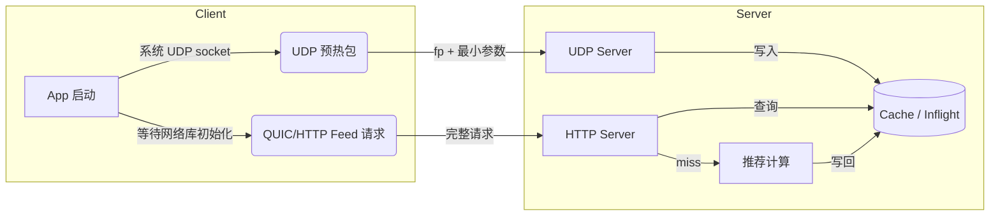
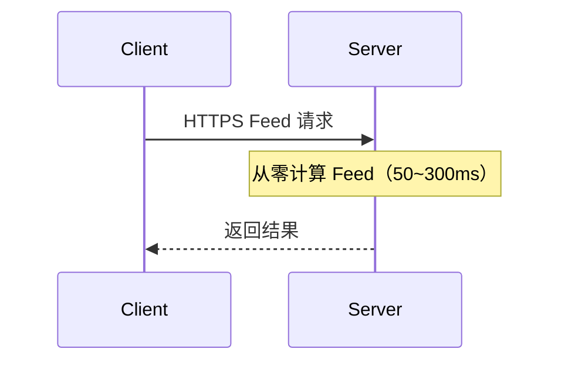
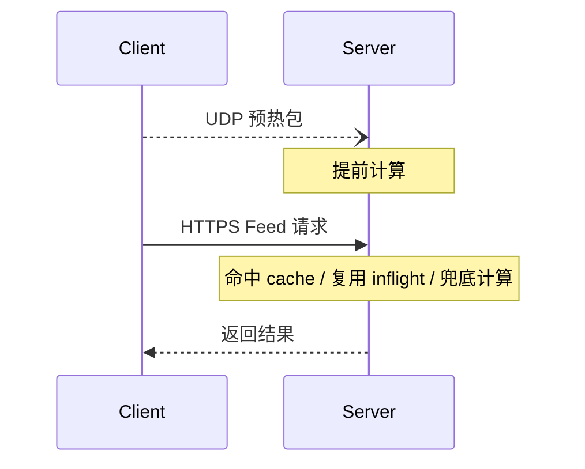

# 抢跑 200ms：Feed 冷启场景下的 UDP 预热方案

> 某高流量 Feed 应用冷启首屏 P50 耗时 ~900ms，拆解后发现其中 200~300ms 花在"等服务端从零开始算推荐"——而这段时间客户端其实什么都没干，只是在等网络库初始化。如果能在这个空窗期提前通知服务端开算，首屏体感延迟就能砍掉一大截。
>
> UDP 预热的思路就是：在 QUIC SDK / 网络库还没完全可用前，先用一个轻量 UDP 包通知服务端提前开算；等正式 Feed 请求走 HTTP/QUIC 主链路到达时，如果结果已完成或正在计算，就直接复用。

---

## 方案概述

**UDP 预热（pre-warming）**：客户端在正式 Feed 请求前，发送 `fp + 最小必要参数 + 签名元信息` 到服务端；服务端按同一套规则重算 `fp`，提前计算候选集、特征、粗排结果或最终响应，并写入短 TTL cache / inflight（即"正在计算中"的 Promise，后续相同请求可以短等复用）。

它不是 TCP/TLS pre-connect，也不是主链路依赖。UDP 包可以丢、可以晚到、可以命不中；命不中时 HTTP 必须透明回退正常计算。

一句话：**UDP 只抢冷启最早的通知包，后续正式请求仍然走 HTTP 主链路。**

下文为了表达简单，`HTTP` 指正式 Feed 请求这一条主链路；它可以是 HTTP/2，也可以是 HTTP/3 over QUIC。

## 先给结论

读这套方案时，先抓住四个边界：

1. **UDP 只负责提前通知**：它不取数据，不承载主鉴权，不影响正式请求兜底。
2. **收益上限由时间窗决定**：最多省掉 `min(预热提前量, 服务端可复用计算耗时)`，命中率低时收益会很快被白算成本吃掉。
3. **服务端复用比发包更难**：`cache / inflight / fallback` 三态必须统一，否则 UDP 到了也可能白算。
4. **安全不能靠客户端静态密钥**：预热包要用短期 ticket、时间窗、nonce 去重和限流控制资源消耗。

---

## 为什么用 UDP

预热包的目标不是取数据，而是尽早告诉服务端："这个 Feed 可能马上要来了。"所以它更看重**第一包能多早发出去**，而不是可靠性。

这里 UDP 不是要替代 QUIC。它省的是冷启第一次请求前，等待 QUIC SDK / 网络库初始化、连接管理、会话票据可用或首次握手这段时间；等主链路可用后，后续 Feed 请求继续走 HTTP/2 或 HTTP/3 over QUIC。

如果客户端已经有可用的 QUIC session ticket，也可能通过 0-RTT 提前发送 application data。但 0-RTT 依赖历史会话信息，存在被服务端拒绝和重放处理要求，且前提仍是 QUIC SDK / 网络栈已经能发包。因此 UDP 预热的价值应限定在“主网络栈尚不可用或初始化更晚”的冷启窗口，而不是泛化为 QUIC 一定更慢。

| 维度 | HTTP / QUIC 预热 | UDP 预热 |
|---|---|---|
| 启动依赖 | 通常要等网络库、QUIC SDK 或连接管理模块初始化 | 可用系统 UDP socket 先发 |
| 建连 | HTTP 冷启可能要 1~2 个 RTT；QUIC 首次通常仍需握手；0-RTT 依赖已有票据且可能被拒绝 | 无握手 |
| 可靠性 | HTTP/2 和 HTTP/3 主请求可靠；HTTP/3 使用 QUIC stream 时也是可靠有序，QUIC DATAGRAM 才是不可靠扩展 | 不可靠，可丢 |
| 返回值 | 可以拿结果 | 不需要返回 |
| 适合场景 | 主链路取数据、后续刷新 | 冷启早期单向抢跑通知 |

这就是裸 UDP 的主要价值：**先发出一个不依赖主网络栈 / QUIC SDK 就能到服务端的通知包**。预热包不需要响应，丢了也只是退化为普通请求。

如果 App 已经完成网络库初始化，并且已有稳定 HTTP/2、QUIC session、可用 0-RTT 条件或长连接，UDP 的边际收益会变小；这时继续使用主链路即可，不需要一直额外发 UDP 预热。

---

## 什么时候值得做

| 判断项 | 适合 | 不适合 |
|---|---|---|
| 服务端计算 | 推荐、跨服务 RPC、DB/缓存聚合耗时明显，通常 > 50ms | 接口本身很轻 |
| 参数 | 核心参数能提前确定 | 参数到请求发出前才知道 |
| 用户感知 | 首屏、刷新、Tab 切换，用户正在等 | 用户不感知等待 |
| 一致性 | 可接受短时间预热产物，并能最终校验 | 支付、下单、库存等强一致接口 |
| 降级 | UDP 失败不影响 HTTP | 预热失败会影响主链路 |

上线后也要持续看退出信号：

| 信号 | 含义 |
|---|---|
| 命中率持续低于 30~40% | 大部分预热白算 |
| 白算率超过 50~60% | 下游资源浪费明显 |
| QPS 放大倍数 > 1.5~2x | 预测错误或多路径预热成本过高 |
| 特定分桶劣化 | 某些网络、地域、设备或版本不适合开启 |

---

## 整体架构



多容器部署时，需要通过 Redis 共享 cache 或按 `fp` 一致性路由，确保 UDP 和 HTTP 能命中同一份预热产物。

---

## 收益怎么算

无预热：



有预热：



粗略估算：

- **用户侧收益 ≈ 预热命中率 × min(预热提前量, 服务端可复用计算耗时)**
- **服务端成本 ≈ 白算率 × 单次预热计算成本 × 预热 QPS**

例子：提前 120ms，服务端计算 200ms，命中率 60%，期望收益约 `60% × min(120, 200) = 72ms`。如果白算率高、QPS 放大明显，就算平均耗时下降，也可能不划算。

---

## 典型场景

| 场景 | 触发点 | 风险 |
|---|---|---|
| 冷启首屏 Feed | Splash / 初始化阶段 | 冷启 QPS 放大 |
| 下拉刷新 | 手指刚下拉、未松手 | freshness 要求高，不能返回旧内容 |
| Tab 切换预测 | 用户停留在 Tab A，预测切到 Tab B | 用户不切换会白算 |
| 预测式预拉 | 行为模型预测下一刷参数 | 预测错会污染缓存和放大资源 |

冷启首屏可以更积极；下拉刷新要更重视新鲜度；预测式预拉要有更严格的命中率和白算率门槛。

---

## 客户端开销

UDP 预热包应该保持很小，但不要假设 JSON 形态天然能小于 200 bytes：`params + ticketId + nonce + timestamp + signature` 很容易膨胀。实践上更稳的是把应用层 payload 目标控制在 512 bytes 内，硬上限控制在约 1200 bytes 内，并避免触发路径 MTU / IP 分片；超限时直接不发预热包，回退正式请求。编码上优先用 protobuf / CBOR / 字段编号，而不是完整业务 JSON。

即使包很小，移动端仍有隐性成本：

| 开销 | 说明 | 缓解 |
|---|---|---|
| Radio 唤醒 | 移动网络下发送任何数据包都会将 radio 从 idle 唤醒到 active，增加约 1~2s 的高功耗窗口 | 冷启且正式 HTTP 确定会发生时，radio 本来就会被唤醒；预测式预热必须单独评估 |
| 流量 | 单包通常只有几百 bytes，但要控制上限，避免分片和 JSON 膨胀 | 压缩字段、使用紧凑编码，超限不发 |
| 电量 | 主要来自 radio 唤醒，而非包本身 | 低电量模式 / 省流量模式下关闭预热 |
| 后台发送 | App 在后台时不应发预热包 | 只在前台 + 用户主动触发场景发送 |
| 端点获取 | 如果冷启还要等待 DNS / 配置中心才能知道 UDP 地址，预热窗口会被吃掉 | UDP endpoint 使用内置兜底或上次成功配置缓存，并设置过期时间 |

结论：冷启且正式请求确定会发生时，UDP 预热的边际客户端开销通常较低。但如果扩展到预测式预拉（用户还没操作就发包），需要评估额外 radio 唤醒、用户退出和后台切换对电量的影响。

---

## 落地关键点

| 关键点 | 要求 | 常见坑 |
|---|---|---|
| fingerprint | 客户端、UDP server、HTTP server 使用同一套字段规范 | 直接对业务 JSON hash，跨语言顺序不一致 |
| 参数白名单 | 只放影响预热结果的字段 | 把 `requestId / nonce / clientTime` 放进 key |
| 规范化 | 固定键顺序、空值规则、数字精度、大小写、数组语义 | 看起来参数一样，hash 实际不同 |
| TTL | cache 通常 1~5s；inflight 要有超时，且尽量取消或隔离真实下游任务 | TTL 太短白做，太长返回旧结果；只 `Promise.race` 超时但下游继续跑 |
| freshness | HTTP 命中后仍做权限、AB、过滤、用户行为校验 | 预热结果覆盖了最新用户意图 |
| 资源隔离 | 预热 worker、队列、下游 budget 低于 HTTP 主链路 | 预热和正式请求抢资源 |
| 安全 | UDP 不放 token 和敏感字段；用短期 ticket / HMAC / 时间窗 / nonce | 把 `fp` 当鉴权依据 |

参数规范化的原则很简单：**先定义字段规范，再做确定性序列化，不要直接拿业务对象 JSON hash**。

### 安全：防伪造与防重放

UDP 是无连接的，任何人都可以伪造源 IP 发包。预热包虽然不返回数据，不是典型的反射放大攻击，但恶意构造的包可以触发服务端计算，形成计算型 DoS / 资源消耗攻击。

更稳的做法是使用服务端通过已鉴权 TLS 主链路下发的短期 prewarm ticket，而不是把长期静态密钥硬编码在 App 里。ticket 可以绑定设备、登录态、场景和 AB 范围，过期后自动失效；UDP 包里只放不可逆的用户标识或服务端派生的 opaque key，不放用户 token、手机号、原始 `userId` 等敏感字段。

多容器部署时，ticket 查询、nonce 去重和 per-ticket 预算必须走共享状态层，或按 ticket / fp 一致性路由到同一安全分片。否则同一个重放包可能在不同容器上分别通过本地 nonce cache，继续触发计算。

```ts
type PrewarmTicket = {
  id: string;
  secret: string;
  expiresAtSec: number;
};

type PrewarmPacket = {
  version: 1;
  fp: string;
  params: FeedParams;
  timestampSec: number;
  nonce: string;
  ticketId: string;
  signature: string;
};

function safeEqualSignature(expectedHex: string, actualHex: string): boolean {
  const expected = decodeHex(expectedHex);
  const actual = decodeHex(actualHex);
  if (!expected || !actual || expected.byteLength !== actual.byteLength) return false;
  return timingSafeEqual(expected, actual);
}

// 客户端构造预热包时
function buildPrewarmPayload(params: FeedParams, ticket: PrewarmTicket): PrewarmPacket {
  const prewarmParams = pickPrewarmParams(params);
  if (!prewarmParams) throw new Error('invalid prewarm params');

  const timestampSec = Math.floor(Date.now() / 1000);
  const nonce = createNonce();
  const fp = fingerprint(prewarmParams);
  const paramsHash = sha256(canonicalize(prewarmParams));
  const signature = hmacSha256(
    ticket.secret,
    ['v1', fp, paramsHash, String(timestampSec), nonce, ticket.id].join('\n'),
  );
  return {
    version: 1,
    fp,
    params: prewarmParams,
    timestampSec,
    nonce,
    ticketId: ticket.id,
    signature,
  };
}

// 服务端校验
function verifyPrewarmPacket(packet: PrewarmPacket): boolean {
  const nowSec = Math.floor(Date.now() / 1000);
  if (packet.version !== 1) return false;
  if (Math.abs(nowSec - packet.timestampSec) > TIME_WINDOW_SEC) return false;

  const ticket = loadPrewarmTicket(packet.ticketId);
  if (!ticket || ticket.expiresAtSec < nowSec) return false;

  const prewarmParams = pickPrewarmParams(packet.params);
  if (!prewarmParams) return false;
  if (fingerprint(prewarmParams) !== packet.fp) return false;

  const paramsHash = sha256(canonicalize(prewarmParams));
  const expected = hmacSha256(
    ticket.secret,
    [
      'v1',
      packet.fp,
      paramsHash,
      String(packet.timestampSec),
      packet.nonce,
      packet.ticketId,
    ].join('\n'),
  );
  if (!safeEqualSignature(expected, packet.signature)) return false;
  if (!ticketAllows(ticket, prewarmParams)) return false;

  // 必须是原子操作，例如 Redis SET nonceKey 1 NX EX TIME_WINDOW_SEC。
  // 放在签名校验之后，避免非法包污染 nonce cache。
  return consumeNonce(ticket.id, packet.nonce, TIME_WINDOW_SEC);
}
```

要点：
- **不放用户 token 和原始用户标识**：UDP 明文传输，token 泄露风险高；用户标识也应使用不可逆或短期派生值。
- **ticket 只从主链路下发**：ticket / secret 必须来自已鉴权的 HTTPS / QUIC 主请求，不能通过 UDP 自举，也不能让客户端长期持有同一 secret。
- **不要依赖长期静态密钥**：App 内置密钥可被逆向，只能作为低价值开关；真正控制资源消耗应依赖短期 ticket、限流和预算。
- **时间窗**：通常 ±30s，拒绝过期包，防止录制重放。
- **nonce 去重**：同一个 ticket 下的 nonce 只能使用一次，避免窗口内重放；多容器下必须用原子 `consumeNonce`，例如 Redis `SET NX EX`，或一致性路由到同一安全分片。
- **常量时间比较**：实际实现时先把 hex / base64 签名解码为 bytes，再用 `timingSafeEqual`；不要直接比较字符串。
- **ticket scope 校验**：签名通过后仍要检查 `viewerKey / scene / abVersion` 等参数是否落在 ticket 绑定范围内，防止合法 ticket 被拿来签任意预热参数。
- **参数类型收窄**：白名单字段只允许标量或标量数组；对象、嵌套结构、`NaN`、`Infinity` 直接拒绝预热，不要用 `String()` 降级成 `"[object Object]"`。
- **限流**：即使签名合法，单 ticket / 单 fp / 单设备派生 key 都要有 QPS 和并发上限；单 IP 限流只能作为辅助，因为 UDP 源地址可能被伪造，也可能被 NAT 聚合放大误伤。
- **先拒绝再计算**：服务端应先做包长、版本、ticket、时间窗、nonce、HMAC、fp 重算等廉价校验，再进入推荐计算队列。

---

## 竞态：HTTP 可能先到

UDP 和 HTTP 是两条独立链路，顺序没有保证。

| 情况 | 时序 | 处理 |
|---|---|---|
| 理想态 | UDP 先到并算完，HTTP 后到 | HTTP 命中 cache |
| UDP 后到 | HTTP 先到，UDP 后到 | HTTP 作为 owner 计算并注册 inflight；UDP 发现已有 inflight 就退出 |
| UDP 在途 | UDP 已触发计算，HTTP 已到 | HTTP 短等同一个 inflight |
| UDP 丢失 | UDP 完全没到 | HTTP 正常计算 |

两态 `cache hit / miss` 不够，服务端要做三态：

1. **cache hit**：直接复用。
2. **inflight exists**：HTTP 短等同一个 Promise，建议 `MAX_WAIT_MS = 10~50ms`。
3. **nothing**：HTTP 自己成为 owner，注册可复用计算并正常返回。

核心伪代码：

```ts
if (cache.has(fp)) return useCache();
if (inflight.has(fp)) return waitBrieflyOrFallback(fp);
return computeByHttpAndRegisterInflight(fp);
```

UDP 侧也要先查 `cache / inflight`，已有就退出，避免重复算。

如果是多容器部署，不能只依赖容器内本地 `Map`：UDP 可能打到 A 容器，HTTP 打到 B 容器，B 看不到 A 的 cache / inflight。常见做法有两种：

| 方案 | 适合情况 | 代价 |
|---|---|---|
| Redis / Memcached 等共享 cache + Redis lock | 接入层无法保证 UDP 和 HTTP 落同一容器 | 多一次远程读写，需要控制超时和 TTL；跨进程不能共享本地 Promise，短等通常靠轮询 cache、Pub/Sub 或 singleflight 服务 |
| 按 `fp` 一致性路由到同一分片 | 接入层可控，能让 UDP / HTTP 同 key 同落点 | 路由实现更复杂，但本地 cache 更快 |

所以 Redis 不是绝对必须，但多容器下通常需要一个**共享状态层**或**一致性路由**，否则预热命中率会很差。

---

## 对应代码

### 核心逻辑（简化版）

整个方案的服务端核心可以压缩成这几行——先查 cache，再查 inflight（正在计算的 Promise），都没有就自己算：

```ts
async function handleFeedRequest(fp: string, params: FeedParams) {
  const cached = cache.get(fp);
  if (cached !== undefined && canUsePrewarmArtifact(params, cached)) {
    return buildFeedFromArtifact(params, cached);
  }

  const pending = inflight.get(fp);
  if (pending) {
    const result = await waitFor(pending, MAX_WAIT_MS);
    if (result.ok && canUsePrewarmArtifact(params, result.value)) {
      return buildFeedFromArtifact(params, result.value);
    }
    return computeFinalFeed(params);
  }

  return computeMainPathAndPublishReusableArtifact(fp, params);
}
```

UDP 预热做的事情就是：在 HTTP 到达之前，提前把结果写进 `cache` 或把计算注册到 `inflight`。

### 完整实现

下面是一个压缩版 TypeScript 示例，展示核心链路：规范化参数、生成 `fp`、UDP 触发预热、HTTP 复用 cache / inflight，等不到就兜底计算。

```ts
type FeedParams = Record<string, unknown>;
type Feed = unknown;
type PrewarmArtifact = unknown;
type WaitResult<T> = { ok: true; value: T } | { ok: false };
type PrewarmTicket = { id: string; secret: string; expiresAtSec: number };
type PrewarmPacket = {
  version: 1;
  fp: string;
  params: FeedParams;
  timestampSec: number;
  nonce: string;
  ticketId: string;
  signature: string;
};

// viewerKey 是服务端派生的 opaque key，不是原始 userId。
const PREWARM_FIELDS = ['viewerKey', 'scene', 'cursor', 'abVersion', 'lang'] as const;
const LOWERCASE_FIELDS = new Set(['scene', 'lang']);
type PrewarmScalar = string | number | boolean;
type PrewarmParamValue = PrewarmScalar | PrewarmScalar[];
type PrewarmParams = Partial<Record<string, PrewarmParamValue>>;
const CACHE_TTL_MS = 3000;
const MAX_WAIT_MS = 30;
const PREWARM_COMPUTE_TIMEOUT_MS = 500;
const MAX_PREWARM_PACKET_BYTES = 1200;
const MAX_FINGERPRINT_LENGTH = 128;
const MAX_TICKET_ID_LENGTH = 128;
const MAX_NONCE_LENGTH = 64;
const MAX_SIGNATURE_LENGTH = 128;

// 单实例示例：多容器部署时，应替换为 Redis 等共享 cache/lock，
// 或确保 UDP / HTTP 按 fp 一致性路由到同一容器。
const cache = new TTLMap<string, PrewarmArtifact>();
const inflight = new Map<string, Promise<PrewarmArtifact>>();

declare function xxhash64(input: string): string;
declare function sleep(ms: number): Promise<void>;
declare function getCurrentPrewarmTicket(): PrewarmTicket | undefined;
declare function buildPrewarmPayload(params: FeedParams, ticket: PrewarmTicket): PrewarmPacket;
declare function verifyPrewarmPacket(packet: PrewarmPacket): boolean;
declare function decodePrewarm(msg: Uint8Array): unknown;
declare function computePrewarmArtifact(
  params: PrewarmParams,
  signal?: AbortSignal,
): Promise<PrewarmArtifact>;
declare function computeFinalFeed(params: FeedParams): Promise<Feed>;
declare function buildFeedFromArtifact(
  params: FeedParams,
  artifact: PrewarmArtifact,
): Promise<Feed>;

function isRecord(value: unknown): value is Record<string, unknown> {
  return typeof value === 'object' && value !== null && !Array.isArray(value);
}

function isPrewarmPacket(value: unknown): value is PrewarmPacket {
  if (!isRecord(value)) return false;
  if (value.version !== 1) return false;
  if (typeof value.fp !== 'string' || value.fp.length > MAX_FINGERPRINT_LENGTH) {
    return false;
  }
  if (!isRecord(value.params)) return false;
  if (!Number.isInteger(value.timestampSec)) return false;
  if (typeof value.nonce !== 'string' || value.nonce.length > MAX_NONCE_LENGTH) {
    return false;
  }
  if (typeof value.ticketId !== 'string' || value.ticketId.length > MAX_TICKET_ID_LENGTH) {
    return false;
  }
  if (typeof value.signature !== 'string' || value.signature.length > MAX_SIGNATURE_LENGTH) {
    return false;
  }
  return (
    value.fp.length > 0 &&
    value.nonce.length > 0 &&
    value.ticketId.length > 0 &&
    value.signature.length > 0
  );
}

function isPrewarmScalar(value: unknown): value is PrewarmScalar {
  if (typeof value === 'string') return value.trim() !== '';
  if (typeof value === 'number') return Number.isFinite(value);
  return typeof value === 'boolean';
}

function isPrewarmParamValue(value: unknown): value is PrewarmParamValue {
  if (isPrewarmScalar(value)) return true;
  return Array.isArray(value) && value.length > 0 && value.every(isPrewarmScalar);
}

function pickPrewarmParams(params: FeedParams): PrewarmParams | undefined {
  const picked: PrewarmParams = {};
  for (const key of PREWARM_FIELDS) {
    const value = params[key];
    if (value === undefined || value === null || value === '') continue;
    if (!isPrewarmParamValue(value)) return undefined;
    picked[key] = value;
  }

  // 实际项目应在这里检查 viewerKey / scene / AB 等业务必填字段。
  return Object.keys(picked).length > 0 ? picked : undefined;
}

function normalizePrewarmScalar(key: string, value: PrewarmScalar): string {
  if (typeof value === 'number') {
    return Number.isInteger(value) ? String(value) : value.toFixed(3);
  }
  if (typeof value === 'boolean') {
    return value ? '1' : '0';
  }

  const text = value.trim();
  return LOWERCASE_FIELDS.has(key) ? text.toLowerCase() : text;
}

function canonicalize(params: PrewarmParams): string {
  const normalized: Record<string, string> = {};

  for (const key of PREWARM_FIELDS) {
    const value = params[key];
    if (value === undefined) continue;

    if (Array.isArray(value)) {
      normalized[key] = JSON.stringify(
        value.map((item) => normalizePrewarmScalar(key, item)),
      );
    } else {
      normalized[key] = normalizePrewarmScalar(key, value);
    }
  }

  return PREWARM_FIELDS
    .filter((key) => key in normalized)
    .map((key) => `${key}=${encodeURIComponent(normalized[key])}`)
    .join('&');
}

function fingerprint(params: PrewarmParams): string {
  // 生产环境建议用 SHA-256 截断前 16 字节；这里用 xxhash64 只表达 key 生成流程。
  return xxhash64(canonicalize(params));
}

function canUsePrewarmArtifact(
  _params: FeedParams,
  _artifact: PrewarmArtifact,
): boolean {
  // 这里应校验用户身份、AB 版本、过滤策略、freshness、近期用户行为等。
  return true;
}

function canAttemptPrewarm(_params: FeedParams): boolean {
  // 实际落地时，客户端可基于低电量、省流量、后台判断；
  // 服务端可基于场景、AB、强一致要求或参数完整性判断。
  return true;
}

async function waitFor<T>(task: Promise<T>, ms: number): Promise<WaitResult<T>> {
  return Promise.race([
    task.then(
      (value) => ({ ok: true as const, value }),
      () => ({ ok: false as const }),
    ),
    sleep(ms).then(() => ({ ok: false as const })),
  ]);
}

async function runAbortablePrewarm<T>(
  run: (signal: AbortSignal) => Promise<T>,
  ms: number,
): Promise<T> {
  const controller = new AbortController();
  let timeoutId: ReturnType<typeof setTimeout> | undefined;
  const timeout = new Promise<never>((_, reject) => {
    timeoutId = setTimeout(() => {
      controller.abort();
      reject(new Error('prewarm compute timeout'));
    }, ms);
  });

  try {
    // computePrewarmArtifact 必须把 signal 继续传给可取消的 RPC / 队列任务；
    // 否则这里只能让调用方返回，不能真正停止下游计算。
    return await Promise.race([run(controller.signal), timeout]);
  } finally {
    if (timeoutId !== undefined) clearTimeout(timeoutId);
  }
}

function getOrComputePrewarmArtifact(
  fp: string,
  params: PrewarmParams,
  timeoutMs?: number,
): Promise<PrewarmArtifact> {
  const cached = cache.get(fp);
  if (cached !== undefined) return Promise.resolve(cached);

  const pending = inflight.get(fp);
  if (pending) return pending;

  const task = Promise.resolve()
    .then(() =>
      timeoutMs === undefined
        ? computePrewarmArtifact(params)
        : runAbortablePrewarm(
            (signal) => computePrewarmArtifact(params, signal),
            timeoutMs,
          ),
    )
    .then((artifact) => {
      cache.set(fp, artifact, { ttlMs: CACHE_TTL_MS });
      return artifact;
    })
    .finally(() => {
      if (inflight.get(fp) === task) inflight.delete(fp);
    });

  inflight.set(fp, task);
  return task;
}

async function computeMainPathAndPublishReusableArtifact(
  fp: string,
  params: FeedParams,
): Promise<Feed> {
  const prewarmParams = pickPrewarmParams(params);
  if (!prewarmParams) return computeFinalFeed(params);

  try {
    const artifact = await getOrComputePrewarmArtifact(fp, prewarmParams);
    if (canUsePrewarmArtifact(params, artifact)) {
      return buildFeedFromArtifact(params, artifact);
    }
  } catch {
    // 预热 artifact 失败不能影响主请求，继续走正式计算。
  }

  return computeFinalFeed(params);
}
```

客户端发送时，只发最小参数、`fp` 和短期 ticket 签名：

```ts
async function fetchFeedWithPrewarm(params: FeedParams): Promise<Feed> {
  const ticket = getCurrentPrewarmTicket();

  if (ticket && canAttemptPrewarm(params)) {
    try {
      const sent = udpClient.send(encodePrewarm(buildPrewarmPayload(params, ticket)));
      void Promise.resolve(sent).catch(() => {});
    } catch {
      // best-effort：UDP 发送失败不能影响正式 Feed 请求。
    }
  }

  return httpClient.get('/feed', { params });
}
```

服务端 UDP 和 HTTP 共享同一套 `fp -> cache / inflight`：

```ts
udpServer.on('message', (msg) => {
  if (msg.byteLength > MAX_PREWARM_PACKET_BYTES) return;

  let packet: unknown;
  try {
    packet = decodePrewarm(msg);
  } catch {
    return;
  }

  if (!isPrewarmPacket(packet)) return;
  if (!verifyPrewarmPacket(packet)) return;

  const prewarmParams = pickPrewarmParams(packet.params);
  if (!prewarmParams) return;

  getOrComputePrewarmArtifact(
    packet.fp,
    prewarmParams,
    PREWARM_COMPUTE_TIMEOUT_MS,
  ).catch(() => {});
});

http.get('/feed', async (req) => {
  if (!canAttemptPrewarm(req.params)) {
    return computeFinalFeed(req.params);
  }

  const prewarmParams = pickPrewarmParams(req.params);
  if (!prewarmParams) {
    return computeFinalFeed(req.params);
  }

  const fp = fingerprint(prewarmParams);

  const cached = cache.get(fp);
  if (cached !== undefined && canUsePrewarmArtifact(req.params, cached)) {
    return buildFeedFromArtifact(req.params, cached);
  }

  const pending = inflight.get(fp);
  if (pending) {
    const warmed = await waitFor(pending, MAX_WAIT_MS);
    if (warmed.ok && canUsePrewarmArtifact(req.params, warmed.value)) {
      return buildFeedFromArtifact(req.params, warmed.value);
    }
    return computeFinalFeed(req.params);
  }

  return computeMainPathAndPublishReusableArtifact(fp, req.params);
});
```

上面假设 `computePrewarmArtifact()` 产出的就是主链路可复用的昂贵中间结果，`buildFeedFromArtifact()` 能在这个 artifact 基础上完成最终响应。HTTP 在 cache miss 且无 inflight 时通过 `computeMainPathAndPublishReusableArtifact()` 成为 owner，先注册同一个可复用计算；如果已有 inflight 但短等失败、计算报错或最终校验不通过，就不再重新 join 同一个 pending，而是透明回退 `computeFinalFeed()`。后台 UDP 预热有独立的 `PREWARM_COMPUTE_TIMEOUT_MS`，预热计算必须主动响应 `AbortSignal` 或由队列 / worker budget 兜底取消；HTTP 主请求则应由正式请求自己的 deadline / cancellation 控制，避免先等预热超时再重复算主链路。

如果主链路无法从中间 artifact 构建最终响应，就不要为了预热先算 artifact 再算正式结果。此时应把 `inflight` 改成更轻量的 owner / singleflight 标记，让 UDP 后到时退出，同时 HTTP 直接走正式计算。

---

## 踩坑实录

以下是实际落地中容易遇到的问题：

| 坑 | 现象 | 根因 | 解法 |
|---|---|---|---|
| fingerprint 跨语言不一致 | 命中率只有 5%，服务端日志显示 fp 全部 miss | 客户端 Swift 和服务端 Go 对 JSON key 排序规则不同，导致同一参数算出不同 hash | 不要依赖 JSON 序列化顺序，改用确定性的 key=value 拼接 |
| TTL 设太短 | 白算率 > 80%，预热算完了但 HTTP 还没到 | cache TTL 设了 500ms，而冷启网络库初始化 + QUIC 握手经常超过 1s | 根据实际 HTTP 到达时间分布设 TTL，通常 2~5s |
| TTL 设太长 | 用户反馈"刷新没变化" | cache 10s，用户快速下拉刷新时命中了上一次的旧结果 | 刷新场景单独设短 TTL 或跳过 cache |
| 预热和主链路抢资源 | 高峰期 P99 劣化 | 预热没有独立限流，和正式请求共享同一个推荐服务线程池 | 预热走独立 worker pool，设 budget 上限 |
| 多容器 cache 不共享 | 命中率远低于预期（~15%） | UDP 打到容器 A，HTTP 打到容器 B，B 看不到 A 的 cache | 引入 Redis 共享 cache 或按 fp 一致性路由 |
| 把 requestId 放进 fp | 命中率 0% | 每次请求的 requestId 不同，fp 永远不一样 | 严格白名单，只放影响推荐结果的字段 |

---

## 上线验收

不要只看服务端平均 RT。主口径建议用 **intent-to-treat**（即不区分是否命中预热，按实验组全量用户统计）：按实验分桶的全部用户 / 请求看收益，而不是只看命中的请求。

| 指标 | 看什么 |
|---|---|
| 首屏可见时间 / 骨架屏停留 | 用户是否真的更快看到内容 |
| P95 / P99 | 长尾是否改善 |
| 预热命中率 | UDP 到达、算完、TTL 有效的综合结果 |
| 预热提前量 | UDP 开始计算到 HTTP 到达的时间差 |
| 白算率 | 预热完成但没有 HTTP 消费的比例 |
| 主链路兜底率 | cache / inflight 都没用上的比例 |
| freshness 失败率 | 预热产物被最终校验拒绝的比例 |
| 下游 QPS 放大倍数 | 资源成本是否可控 |
| 弱网 / 低端机 / 地域分桶 | 是否局部劣化 |

建议 outcome 至少打这些：`sent / received / rejected_size / rejected_ticket / rejected_hmac / rejected_nonce / rejected_fp / deduped / owner_exists / prewarm_started / prewarm_completed / compute_timeout / cache_hit / inflight_wait / timeout_fallback / freshness_failed / cold_compute / prewarm_aborted`。

---

## 上线前最小 checklist

1. UDP 和 HTTP 的 fingerprint 有跨语言测试向量。
2. UDP payload 只包含 `fp + 最小必要参数 + 短期 ticket 签名信息`，有包长硬上限，超限不发。
3. 服务端会重算 `fp`，不信任客户端传来的 key。
4. 多容器下 ticket、nonce、限流预算、cache / inflight 使用共享状态层或一致性路由。
5. cache / inflight / fallback 三态都可观测。
6. HTTP 命中后仍做身份、AB、过滤、freshness 校验。
7. 预热链路有独立限流、队列和下游 budget。
8. 低电量、省流量、后台、漫游、极弱网可关闭或降采样。
9. 支持按网络、地域、设备、版本、场景分桶降级。

---

## 一句话总结

> **UDP 预热 = 用一个廉价的网络通知，让服务端比客户端早一步开始干活。**

它适合"重计算 + 参数可预测 + 用户正在等"的 Feed 场景。真正的难点不是发 UDP，而是让这次抢跑能被 HTTP 正确复用，并且在命不中、重复算、弱网、资源压力和 freshness 校验失败时都能稳定降级。
