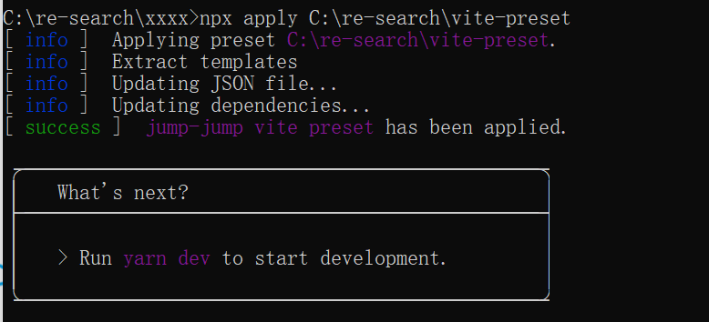

# 利用增量构建工具 Preset 打造自己的样板库

你是如何开始一个项目呢？是基于当前技术栈提供的脚手架还是从 **npm init** 开始呢？

以前我没得选，必须面向搜索引擎。基于 webpack 或 rollup 来一步步构建项目，在开发过程中还有可能发生很多错误。但现在我只想专注于当前业务，挑选合适的脚手架之后迅速构建自己的项目，这样的话，就可以把大量维护性的工作交给开源作者。

当然，知名的脚手架工具（Vue CLI,Umi，Vite 等）自不必说，这里我推荐几个顺手的工具。

-  [microbundle-crl](https://www.npmjs.com/package/microbundle-crl)  专注于 React 组件的构建
-  [tsdx](https://github.com/formium/tsdx) 专注于 TypeScript  库的构建
-  [crateApp](https://createapp.dev/webpack) 根据当前选项配置生成项目包 (多个基础构建工具 Webpack,Parcel,Snowpack)

但无论是哪一个样板库或者脚手架，都不会完全符合当前业务的需求，开发者需要基于当前的样板进行修改。比如说需要在项目中要添加开源协议，修改项目名称，以及为项目添加不同的依赖。

从构建来说，目前有两个问题：

- 大量重复性操作

如果生成项目的工作频率很高的话，例如一周写一个业务性组件。虽然每次在项目中要添加开源协议，修改项目名称，添加特定依赖都是一些小活，但频率高起来也是一件麻烦的事情。

- 底层依赖无法直接升级

如果开发者修改了当前样板，那么脚手架出现破坏性更新时候就无法直接升级（这种问题当然也比较少）。虽然开发过程中会记录一些修改。但随着时间的偏移，开发者不会确切知道需要编辑或删除哪些文件才能使升级后的项目正常工作。

话不多说，我们来看一看工具 [Preset](https://preset.dev/)  是如何解决这一系列的问题的。

## 使用 Preset 

首先建立一个项目，以 vite 为例子，package.json 如下所示

```json
{
  "name": "vite-preset",
  "version": "0.0.1",
  "author": "jump-jump",
  "license": "MIT",
  "preset": "preset.ts",
  "prettier": {
    "printWidth": 80,
    "tabWidth": 2,
    "trailingComma": "all",
    "singleQuote": true,
    "arrowParens": "always",
    "useTabs": false,
    "semi": true
  },
  "devDependencies": {
    "apply": "^0.2.15"
  }
}
```

执行下面的操作，我们会的到  my-vue-app 文件。

```bash
# npm 6.x
npm init @vitejs/app my-vue-app --template vue
```

拿到了当前命令生成的结果之后我们把当前生成文件拷贝到 vite-preset 根目录下的 templates 中(即 templates/vite ) 文件夹下。

然后我们通过 preset.ts（对应 package.json 中的 preset": "preset.ts" ） 编写  Preset 命令。

```ts
import {Preset, color} from 'apply'

// 当前编写项目的名称，会在控制台中展示
Preset.setName('jump-jump vite preset')

// 从 templates/vite 中提取所有文件，并携带以 . 开头的文件 如 .gitignore 等	
Preset.extract('vite')
  .withDots()


// 更新当前 package.json 文件，添加依赖 tailwindcss,移除依赖 sass
Preset.editNodePackages()
  .add('tailwindcss', '^2.0')
  .remove('sass')

// 安装所有依赖
Preset.installDependencies()

// 运行提示
Preset.instruct([
  `Run ${color.magenta('yarn dev')} to start development.`,
]).withHeading("What's next?");
```

完成了！

我们可以来试试效果，我寻找一个合适的文件夹，然后运行指令:

```bash
// 解析 vite-preset 项目
npx apply C:\re-search\vite-preset
```



之前保存的 vite 样板文件夹被解压到当前文件夹下，此时依赖也被替换掉了，当然，我们也可以指定文件夹下安装，如

```bash
npx apply C:\re-search\vite-preset vite-demo
```

vite 样板板被解压到当前文件夹下的 vite-demo 文件夹中去了。

我们不但可以使用本地路径，当然，我们也可以使用 github 路径。如：

```bash
npx apply git@github.com:useName/projectName.git

// 等同于
npx apply username/projectName
```

目前来看，效果勉强还可以，实际上我们能够操作的远不止上述展示的，那么我开始逐个解读一下 Preset 的各个命令。

## 玩转 Preset 

### setName 工程名设置

正如上面图片展示的那样，该命令设置成功后会显示在控制台中。

```ts
Preset.setName('jump-jump preset')
```

### setTemplateDirectory 样板目录设置

此操作会修改提取根路径，不使用则默认选项为 templates。

```ts
// 文件提取根路径被改为了 stubs 而不是 templates
Preset.setTemplateDirectory('stubs');
```

###  extract 文件夹提取 

此操作允许将文件从预设的样板目录提取到目标目录。在大多数情况下，这个命令已经可以解决绝大部分问题。

```ts
// 当前会提取整个根样板 即 templates 或者 stubs
Preset.extract();

// 当前会提取 templates/vite 文件夹到根目录
Preset.extract('vite'); 

// 先提取 templates/presonal，然后提取  templates/presonal 文件夹
Preset.extract('vite'); 
Preset.extract('presonal'); 

// 等同于 Preset.extract('vite')
Preset.extract().from('vite'); 

// 提取到根路径下的 config 文件夹
Preset.extract().to('config');

// 遇到文件已存在的场景 [ask 询问， override 覆盖， skip 跳过]
// 注意：如果询问后拒绝，将会中止当前进度
Preset.extract().whenConflict('ask');

// 在业务中，我们往往这样使用,是否当前式交互模式？
// 是则询问，否则覆盖
Preset.extract().whenConflict(Preset.isInteractive() ? 'ask' : 'override')


// 如果没有此选项，以 .开头的文件(如 .gitignore .vscode) 文件将被忽略。
// 注意：建议在样板中使用 .dotfile 结尾。 
// 如： gitignore.dotfile => .gitignore
Preset.extract().withDots();
```

## editJson 编辑 JSON 文件

使用 editJson  可以覆盖和删除 JSON 文件中的内容。

```TS
// 编辑 package.json 深度拷贝数据
Preset.editJson('package.json')
  .merge({
    devDependencies: {
      tailwindcss: '^2.0'
    }
  });

// 编辑 package.json 删除 开发依赖中的 bootstrap 和 sass-loader
Preset.editJson('package.json')
  .delete([
    'devDependencies.bootstrap',
    'devDependencies.sass-loader'
  ]);
```

当然，Preset 为 node 项目提供了简单的控制项 editNodePackages 。

```TS
Preset.editNodePackages()
  // 会删除 bootstrap 
  // 无论是 dependencies, devDependencies and peerDependencies
  .remove('bootstrap')
  // 添加 dependencies  
  .add('xxx', '^2.3.0')
  // 添加 devDependencies
  .addDev('xxx', '^2.3.0')
  // 添加 peerDependencies
  .addPeer('xxx', '^2.3.0')
  // 设置键值对         
  .set('license', 'MIT')
  .set('author.name', 'jump-jump')
```

### installDependencies 安装依赖

在搭建项目的同时我们需要安装依赖，这里通过 installDependencies 完成。

```ts
// 安装依赖，默认为 node，也支持 PHP
Preset.installDependencies();

// 询问用户是否安装
Preset.installDependencies('php')
  .ifUserApproves();
```

### instruct 引导

该命令可以添加标语来一步步引导用户进行下一步操作，还可以添加各种颜色。

```ts
import { Preset, color } from `apply`;

Preset.instruct([
  `Run ${color.magenta('yarn dev')} to start development.`,
]).withHeading("What's next?");
```

### options 设置配置

开发者想要添加多个样板，是否需要开发多个项目呢？答案是否定的，我们通过 options 获取参数即可。

```
npx apply C:\re-search\vite-preset vite-demo --useEsbuild
```

当前数据会被设置到 Preset.options 中。

```TS
// 默认设置 useEsbuild 为 true
Preset.option('useEsbuild', true);
// 默认设置 use 为字符串 esbuild
Preset.option('use', 'esbuild');

// 如果配置项 useEsbuild 为 ture 解压 templates/esbuild
// 也有 ifNotOption 取反
Preset.extract('esbuld').ifOption('useEsbuild');

// use 严格相等于 esbuild 解压 templates/esbuild
Preset.extract('esbuld').ifOptionEquals('use','esbuild');

Preset.extract((preset) => {
  // 如果配置项 useEsbuild 为 ture 解压 templates/esbuild
  if (preset.options.useEsbuild) {
    return 'esbuild';
  }

  return 'vite';
});
```

我们可以在执行 npx 是添加配置项，如下所示

| 标志          | 价值观             |
| ------------- | ------------------ |
| `--auth`      | `{ auth: true }`   |
| `--no-auth`   | `{ auth: false }`  |
| `--mode auth` | `{ mode: 'auth' }` |

### input confirm 交互设置

Preset 设置配置项很棒。但就用户体验来说，通过交互设置则更好。这样我们无需记忆各个配置项。通过人机交互来输入数据，当前数据会被添加到 Preset.prompt 中。

```TS
// 第一个参数将传入 Preset.prompt
Preset.input('projectName', 'What is your project name?');

// 第三个是可选的上下文字符串，用于定义提示的默认值。
// 如果预设是在非交互模式下启动的，它将被使用。
Preset.input('projectName', 'What is your project name?', 'jump project');

// 编辑脚本
Preset.editNodePackages()
	.set('name', Preset.prompt.projectName)
	.set('license', 'MIT')
	.set('author.name', 'jump-jump')

// 第一个参数将传入 Preset.prompt
// 第三个是可选的上下文布尔值，用于定义提示的默认值。
// 如果预设是在非交互模式下启动的，它将被使用。
Preset.confirm('useEsLint', 'Install ESLint?', true);
```


### delete edit 修改文件

删除生成文件夹中的文件直接使用 delete

```TS
Preset.delete('resources/sass');
```

编辑文件

```TS
// 替换文本字符串
Preset.edit('config/app.php').update((content) => {
	return content.replace('en_US', 'fr_FR');
});

// 替换 README.md 文件中的字符串 {{ projectName }}
// {{prejectName}} => prompts.name ?? 'Preset'
Preset.edit('README.md').replaceVariables(({ prompts }) => ({
	projectName: prompts.name ?? 'Preset',
}));
```

### execute 执行 bash 命令

如果之前的命令都不能满足你，那只能执行 bash 命令了吧！Preset 也提供了这个功能，结合 hooks 可添加各种参数。

```TS
// 利用钩子将数据存储到 context 中
Preset.hook(({ context, args, options }) => {
	const allowedOptions = ['auth', 'extra'];

	context.presetName = args[2];
	context.options = Object.keys(options)
		.filter((option) => allowedOptions.includes(option))
		.map((option) => `--${option}`);
});

// 第一个参数是程序或者命令名称，后面是参数，从 context 中读取
Preset.execute('php')
	.withArguments(({ context }) => [
		'artisan', 
		'ui', 
		context.presetName, 
		...context.options
	])
    // 修改当前标题，当前执行时会在控制台打印如下字符串，而不是默认字符串
	.withTitle(({ context }) => `Applying ${context.presetName}`);
```

## 进一步思考

通过对 Preset 库的学习，我们可以看到 Preset 具备非常不错的设计风格与强大的功能。Preset 没有从底层构建项目，反而是帮助开发者通过一些命令衍生出自己的工具，同时还可以记录开发者绝大部分对于项目的修改。

### 增量思想

在使用 Preset 构建样板的过程中，开发者没有对原本的样板进行修改，这样使得开发者升级原始样本变得非常简单。在构建 Preset 项目过程其实也就是修改样板增量。

我们应该进一步在开发中使用增量思想，在这里「增量」这个概念的对立面是「全量」。增量会根据比对当前与过去之间的差异，只关注差异性所带来的影响。

增量有很多实际的意义，我们可以看到：

- 前后端交互时候前端只提交变化的数据
- rsync 增量同步文件
- 网盘增量上传文件
- 数据库增量备份
- 增量代码检查、构建、打包

### 链式调用

随着前端框架带来了数据驱动，JQuery 逐渐退出历史舞台（Bootstrap 5 去除了 JQuery）。ES 不断升级也给与用户大量帮助，用户无需自行构建对象进行链式调用了。但这并不意味链式调用不重要。

因为链式调用可以优雅的记录时序，开发者可以依赖当前调用来进行分析。

大多数工具都会提供不同的配置项。此时我们可以直接传入配置项来使用工具。

如果当前操作有时序性（先后顺序决定最终结果），构建对象进行链式调用则更有效。当然你可以说我们添加一个数组配置来决定顺序。但面对复杂的顺序，优秀的函数命名可以让用户更简单的理解代码。

又如果，我们在面对复杂的图形结构时，构建对象来进行节点的选择与操作一定会更加简单。如果有需求，我们甚至需要根据链式调用来生成 sql 语句。

## 参考资料

[Preset](https://preset.dev/)

[microbundle-crl](https://www.npmjs.com/package/microbundle-crl)

[tsdx](https://github.com/formium/tsdx)

[crateApp](https://createapp.dev/webpack)

